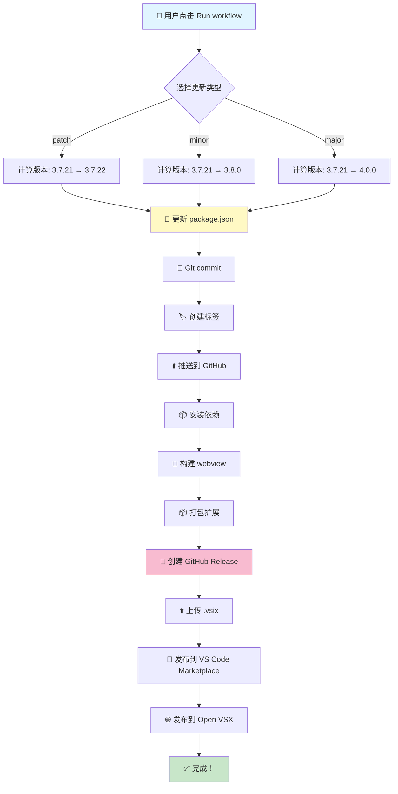

# 🎨 Vlinder 自动发布流程图

## 🚀 一键发布流程



## 📊 三种工作流对比

```
┌─────────────────────────────────────────────────────────────────┐
│                    🚀 一键发布 (推荐)                            │
├─────────────────────────────────────────────────────────────────┤
│ 输入: 选择 patch/minor/major                                     │
│ 版本号: ✅ 自动计算                                              │
│ 提交: ✅ 自动                                                    │
│ 发布: ✅ 自动                                                    │
│ 难度: ⭐ 最简单                                                  │
│ 用途: 日常发布                                                   │
└─────────────────────────────────────────────────────────────────┘

┌─────────────────────────────────────────────────────────────────┐
│                    📦 标准发布                                   │
├─────────────────────────────────────────────────────────────────┤
│ 输入: 选择类型或自定义版本号                                     │
│ 版本号: ✅ 自动计算 或 ✅ 自定义                                 │
│ 提交: ✅ 自动                                                    │
│ 发布: ✅ 自动                                                    │
│ 难度: ⭐⭐ 简单                                                  │
│ 用途: 需要特定版本号时                                           │
└─────────────────────────────────────────────────────────────────┘

┌─────────────────────────────────────────────────────────────────┐
│                    🤖 Copilot 智能发布                           │
├─────────────────────────────────────────────────────────────────┤
│ 输入: 选择类型 + 是否使用 Copilot                                │
│ 版本号: ✅ 自动计算 或 ✅ 自定义                                 │
│ 提交: ✅ 自动                                                    │
│ 发布: ✅ 自动                                                    │
│ Release Notes: ✅ Copilot 生成 (可选)                            │
│ 难度: ⭐⭐⭐ 中等                                                │
│ 用途: 重要版本，需要专业 Release Notes                           │
└─────────────────────────────────────────────────────────────────┘
```

## 🔄 版本号自动计算逻辑

```
当前版本: 3.7.21

┌─────────┐
│  patch  │ → 3.7.22  (最后一位 +1)
└─────────┘
    ↓
    适用于:
    • Bug 修复
    • 小改进
    • 文档更新

┌─────────┐
│  minor  │ → 3.8.0   (中间一位 +1, 最后一位归 0)
└─────────┘
    ↓
    适用于:
    • 新功能
    • 向后兼容的更改
    • API 增强

┌─────────┐
│  major  │ → 4.0.0   (第一位 +1, 其他归 0)
└─────────┘
    ↓
    适用于:
    • 重大架构变更
    • 不兼容的更改
    • 重大功能重写
```

## 📈 完整发布时间线

```
时间轴 (总计约 5-10 分钟)

00:00 ━━━━━━━━━━━━━━━━━━━━━━━━━━━━━━━━━━━━━━━━━━━━━━━━━━━━━━━
      │ 👤 用户点击 "Run workflow"
      │
00:10 ├─ 📥 检出代码
      │
00:20 ├─ 🔧 设置 Node.js 和 pnpm
      │
00:30 ├─ 🔢 计算新版本号
      │    当前: 3.7.21 → 新: 3.7.22
      │
00:40 ├─ 📝 生成更新日志
      │    收集提交信息
      │
00:50 ├─ 💾 更新 package.json
      │    写入新版本号
      │
01:00 ├─ 🏷️ 提交并创建标签
      │    git commit + git tag
      │
01:10 ├─ ⬆️ 推送到 GitHub
      │    git push
      │
01:30 ├─ 📦 安装依赖
      │    pnpm install (约 1-2 分钟)
      │
03:00 ├─ 🔨 构建 webview
      │    pnpm run build:webview (约 30 秒)
      │
03:30 ├─ 📦 打包扩展
      │    pnpm run build (约 30 秒)
      │
04:00 ├─ 🎉 创建 GitHub Release
      │    创建 Release + 上传 .vsix
      │
05:00 ├─ 🛒 发布到 VS Code Marketplace
      │    vsce publish (约 1-2 分钟)
      │
07:00 ├─ 🌐 发布到 Open VSX
      │    ovsx publish (约 1-2 分钟)
      │
09:00 ├─ 📊 生成发布摘要
      │    显示所有链接
      │
10:00 └─ ✅ 完成！
      
━━━━━━━━━━━━━━━━━━━━━━━━━━━━━━━━━━━━━━━━━━━━━━━━━━━━━━━━━━━━
```

## 🎯 用户操作 vs 自动化

```
┌─────────────────────────────────────────────────────────────────┐
│                        传统方式                                  │
├─────────────────────────────────────────────────────────────────┤
│ 1. 👤 手动编辑 package.json                                      │
│ 2. 👤 手动计算版本号                                             │
│ 3. 👤 手动 git add                                               │
│ 4. 👤 手动 git commit                                            │
│ 5. 👤 手动 git tag                                               │
│ 6. 👤 手动 git push                                              │
│ 7. 👤 手动 pnpm install                                          │
│ 8. 👤 手动 pnpm build                                            │
│ 9. 👤 手动创建 Release                                           │
│ 10. 👤 手动上传 .vsix                                            │
│ 11. 👤 手动发布到 Marketplace                                    │
│ 12. 👤 手动发布到 Open VSX                                       │
│                                                                  │
│ 总计: 12 个手动步骤，容易出错，耗时 20-30 分钟                   │
└─────────────────────────────────────────────────────────────────┘

                            ↓ ↓ ↓

┌─────────────────────────────────────────────────────────────────┐
│                        自动化方式                                │
├─────────────────────────────────────────────────────────────────┤
│ 1. 👤 点击 "Run workflow"                                        │
│ 2. 👤 选择 patch/minor/major                                     │
│ 3. 👤 点击 "Run workflow"                                        │
│                                                                  │
│ 然后系统自动完成所有其他步骤！                                    │
│                                                                  │
│ 总计: 3 个简单点击，零出错，耗时 5-10 分钟（无需人工等待）        │
└─────────────────────────────────────────────────────────────────┘
```

## 🔐 安全性和权限

```
┌─────────────────────────────────────────────────────────────────┐
│                        GitHub Secrets                            │
├─────────────────────────────────────────────────────────────────┤
│                                                                  │
│  🔒 VSCE_TOKEN                                                   │
│     ├─ 用途: 发布到 VS Code Marketplace                          │
│     ├─ 权限: Marketplace (Publish)                               │
│     └─ 安全: 加密存储，不会在日志中显示                           │
│                                                                  │
│  🔒 OVSX_TOKEN                                                   │
│     ├─ 用途: 发布到 Open VSX Registry                            │
│     ├─ 权限: Publish                                             │
│     └─ 安全: 加密存储，不会在日志中显示                           │
│                                                                  │
│  🔒 GITHUB_TOKEN (自动提供)                                      │
│     ├─ 用途: 创建 Release, 推送代码                              │
│     ├─ 权限: contents: write                                     │
│     └─ 安全: GitHub 自动管理                                     │
│                                                                  │
└─────────────────────────────────────────────────────────────────┘
```

## 📊 发布成功率优化

```
┌─────────────────────────────────────────────────────────────────┐
│                    提高发布成功率的措施                           │
├─────────────────────────────────────────────────────────────────┤
│                                                                  │
│  ✅ 自动化版本号计算                                             │
│     └─ 避免手动输入错误                                          │
│                                                                  │
│  ✅ 自动化 Git 操作                                              │
│     └─ 避免忘记提交或推送                                        │
│                                                                  │
│  ✅ 依赖缓存                                                     │
│     └─ 加速构建，减少网络问题                                    │
│                                                                  │
│  ✅ 详细的错误日志                                               │
│     └─ 快速定位问题                                              │
│                                                                  │
│  ✅ 发布摘要                                                     │
│     └─ 清晰显示发布结果和链接                                    │
│                                                                  │
│  ✅ 失败重试机制                                                 │
│     └─ 可以重新运行失败的工作流                                  │
│                                                                  │
└─────────────────────────────────────────────────────────────────┘
```

## 🎊 发布后的验证流程

```
发布完成后 → 自动生成摘要 → 包含以下链接:

┌─────────────────────────────────────────────────────────────────┐
│  📦 GitHub Release                                               │
│     https://github.com/QuickerStudio/Vlinder/releases           │
│     ├─ 检查版本号                                                │
│     ├─ 检查 Release Notes                                        │
│     └─ 下载 .vsix 测试                                           │
└─────────────────────────────────────────────────────────────────┘

┌─────────────────────────────────────────────────────────────────┐
│  🛒 VS Code Marketplace                                          │
│     https://marketplace.visualstudio.com/items?...               │
│     ├─ 检查版本号                                                │
│     ├─ 检查更新时间                                              │
│     └─ 测试安装                                                  │
└─────────────────────────────────────────────────────────────────┘

┌─────────────────────────────────────────────────────────────────┐
│  🌐 Open VSX Registry                                            │
│     https://open-vsx.org/extension/QuickerStudio/vlinder         │
│     ├─ 检查版本号                                                │
│     ├─ 检查更新时间                                              │
│     └─ 测试安装                                                  │
└─────────────────────────────────────────────────────────────────┘
```

## 💡 最佳实践建议

```
┌─────────────────────────────────────────────────────────────────┐
│                        发布频率建议                              │
├─────────────────────────────────────────────────────────────────┤
│                                                                  │
│  🐛 Bug 修复 (patch)                                             │
│     频率: 随时                                                   │
│     示例: 3.7.21 → 3.7.22                                        │
│                                                                  │
│  ✨ 新功能 (minor)                                               │
│     频率: 每 1-2 周                                              │
│     示例: 3.7.21 → 3.8.0                                         │
│                                                                  │
│  🚀 重大更新 (major)                                             │
│     频率: 每 1-3 个月                                            │
│     示例: 3.7.21 → 4.0.0                                         │
│                                                                  │
└─────────────────────────────────────────────────────────────────┘

┌─────────────────────────────────────────────────────────────────┐
│                    Copilot 额度使用建议                          │
├─────────────────────────────────────────────────────────────────┤
│                                                                  │
│  总额度: 50 次/月                                                │
│                                                                  │
│  📝 发布相关 (15 次)                                             │
│     ├─ 重要版本 Release Notes (5 次)                             │
│     ├─ 代码审查 (5 次)                                           │
│     └─ 配置优化 (5 次)                                           │
│                                                                  │
│  💻 开发相关 (25 次)                                             │
│     ├─ 代码优化 (10 次)                                          │
│     ├─ Bug 修复 (8 次)                                           │
│     └─ 新功能开发 (7 次)                                         │
│                                                                  │
│  🚨 紧急预留 (10 次)                                             │
│     └─ 紧急问题处理                                              │
│                                                                  │
└─────────────────────────────────────────────────────────────────┘
```

---

**🦋 让发布流程像蝴蝶一样优雅流畅！**

