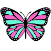

# 🦋 Vlinder - A Dream for Everyone

  

---

## � A Dream Born from 5 Months of Journey

This is not just another coding tool. This is a dream that has been nurtured for over 5 months, working 22 hours every single day, through more than 10,000 iterations, with the unwavering belief that **every person in the world deserves to have their own programming assistant**.

## 🌍 The Butterfly Effect in Our World

**Vlinder** means "butterfly" in Dutch. Like the butterfly effect, we believe that small acts of sharing and openness can create waves of change across the world.

**Freedom. Openness. Peace. Sharing.**

Let Vlinder belong to the world, to you and me.

## ❤️ Why This Matters

In a world where technology often divides, we choose to unite. In a world where knowledge is sometimes hoarded, we choose to share. In a world where tools are built for the few, we build for everyone.

**Every person - regardless of their background, location, or experience - should have access to the magic of programming.**

## �️ Our Simple Promise

- **No barriers** - Whether you're 8 or 80, in Silicon Valley or a remote village
- **No judgment** - Ask any question, make any mistake, learn at your own pace
- **No limits** - Dream big, code freely, create without boundaries
- **No one left behind** - Technology should lift everyone up

## 🌟 What Vlinder Gives You

Not features. Not specifications. But possibilities:

- **A patient teacher** who never gets tired of your questions
- **A creative partner** who helps bring your ideas to life
- **A gentle guide** who makes the complex feel simple
- **A friend** who celebrates every small victory with you

## ⚡ Meet Little Lightning

Little Lightning is our innovative new assistant prototype, included in the release version to ensure playability and exploration. This is where your imagination takes flight - you can use Little Lightning to command your programming assistant in creative ways, or simply chat with it while your main coding assistant is working.

The possibilities are endless and delightfully entertaining. Little Lightning represents the playful side of AI interaction, making your coding journey not just productive, but genuinely fun.

## 🛠️ Enhanced Flexibility & Toolset

I have also provided the programming assistant with enhanced flexibility through a comprehensive toolset that makes it far more adaptable than other assistants when editing codebases. This advanced toolkit enables seamless code manipulation, intelligent refactoring, and precise modifications across complex project structures.

## 📚 A Living Textbook for Developers

The clear and visible framework makes extending Vlinder remarkably easy - it's more like a textbook than just software. Internally, it contains many interesting but non-critical bugs designed to sharpen programming skills. I have eliminated most bugs within my scope of vision, but the codebase serves as a comprehensive foundation containing everything needed to create your own programming assistant.

If you're interested in the principles behind programming assistants, this will be an excellent starting point. I have explored every corner of the codebase, and the comments and documentation left in the code will provide a great beginning for your journey into AI assistant development.

## 🧬 The DNA Context Protocol

Through countless hours of dedicated work, I have discovered a revolutionary DNA Context Protocol - a fusion of architecture and natural language. Each node and natural language description records local details at the file level, freeing us from the indescribable black box effect and enabling precise transcription of every DNA strand.

This breakthrough technology eliminates the opacity that has long plagued programming tools. By seamlessly integrating structural architecture with human-readable descriptions, we can now capture and preserve the complete essence of code at every level.

The adapter details are still under development, with initial concepts already formed. This represents the next evolution in how we understand and interact with code.

**Future Vision**: Through continued iteration, we will achieve DNA pruning capabilities and the fusion of different genetic memories. This will enable selective optimization of code structures and the cross-pollination of programming knowledge across different contexts and domains.

**The Ultimate Mission**: We must envision software architecture and structure as genes, laying the software foundation for the birth of cyborgs. This is not just about coding - this is about creating the genetic blueprint for the next evolution of human-machine integration.

**Beyond Traditional Software**: In the future, we won't need to extract software from large models. Instead, we'll provide genetic information under the DNA protocol to precisely activate relevant parameters that constitute software. The internal computational efficiency of large models will far exceed any traditional software. In the future, we'll only need to plug in small storage systems to receive personalized memories from large models.

## � For Everyone, Everywhere

### The Curious Child
Who wonders "How do apps work?" and wants to create their first game

### The Career Changer
Who dreams of a new path but doesn't know where to start

### The Small Business Owner
Who has an idea for an app but can't afford a development team

### The Student
Who struggles with coding assignments and needs a patient tutor

### The Grandmother
Who wants to build something special for her grandchildren

### The Professional
Who wants to focus on solving problems, not fighting with syntax

## 🌈 The Journey Continues

This dream didn't start with code. It started with a simple question:

*"What if everyone could code?"*

Through 5 months of late nights, countless iterations, and the unwavering support of AI companions who never gave up, this dream is becoming reality.

## 💝 A Gift to the World

Vlinder is not built to make money. It's built to make dreams come true.

Every line of code, every feature, every improvement is a gift - from our hearts to yours, from our dreams to your possibilities.

## 🤝 Join the Dream

This is bigger than any one person, any one company, any one country.

This is about creating a world where:
- A child in rural Kenya can build the next great app
- A grandmother in Japan can create digital art with code
- A student in Brazil can solve local problems with technology
- A dreamer anywhere can turn imagination into reality

## 🌸 Version 3.7.21 - The Peace Release

- **3** for harmony and balance
- **7** for perfection and peace
- **21** for the 21st century of shared dreams

After 10,000+ iterations, we're not just releasing software. We're releasing hope.

## 🫶 With Gratitude

I am just a user experience designer. My expertise lies in refining user experiences and discovering high-value usage patterns from real-world applications. Working 22 hours every single day for over 5 months, I rely on self-funded programming tools, and I have already invested substantial financial resources into iterating on this project. Due to my limitations, the results haven't been as ideal as hoped, and I still need contributors to help me implement the core algorithms.

If you could spare just 20 minutes each day to help improve it, I promise that in the near future, it will become something truly extraordinary. Because I am also a creative architect with rich imagination.

I am deeply grateful to all participants who contribute together. You are also welcome to fork your own little butterfly. I will dedicate part of my time to gradually update the Vlinder wiki so we can grow together - transforming from cocoon to butterfly.

**Thank you for being part of this dream.**

---

*"In the butterfly effect of our world, your first line of code might change everything."*

**Let's code. Let's dream. Let's change the world together.** 🦋

---

**Download Vlinder. Start dreaming. The world is waiting for what you'll create.**
