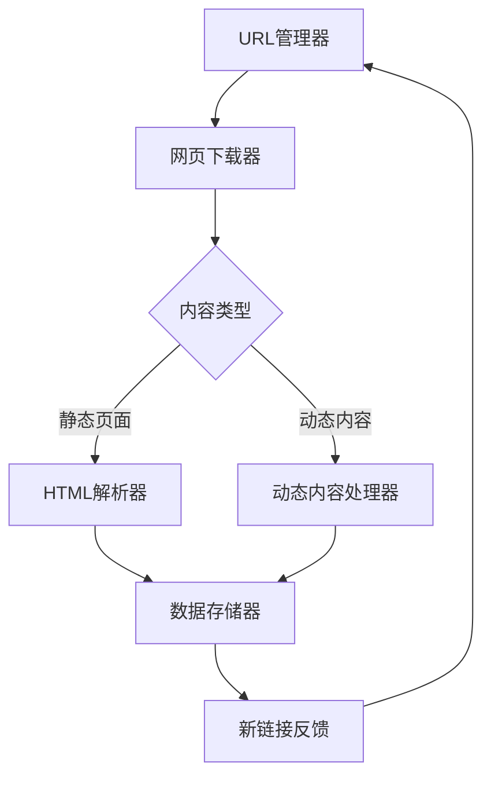
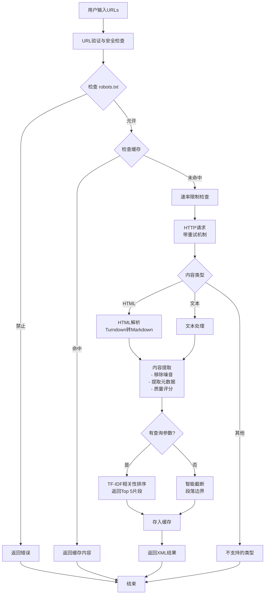

# 网络爬虫架构 - Vlinder Fetch Webpage Tool

## 标准爬虫架构流程



## Vlinder 实现架构



## 核心组件详解

### 1. URL管理器 (URL Manager)

**标准实现：**
- 维护待抓取队列
- 已抓取URL集合
- 去重逻辑
- 调度策略（BFS/DFS）

**Vlinder 实现：**
```typescript
// 输入验证
if (urls.length === 0 || urls.length > MAX_URLS) {
  return error;
}

// 并行抓取（隐式队列管理）
const results = await Promise.all(
  urls.map(url => fetchSingleUrl(url, index, query))
);
```

**特点：**
- ✅ 支持批量URL（最多10个）
- ✅ 并行抓取提高效率
- ✅ 通过缓存实现去重
- ⚠️ 不支持递归抓取（可扩展）

---

### 2. 网页下载器 (Web Downloader)

**标准实现：**
- HTTP/HTTPS请求
- 代理支持
- Cookie管理
- 请求头设置

**Vlinder 实现：**
```typescript
// 真实浏览器头
const headers = {
  'User-Agent': 'Mozilla/5.0 (Windows NT 10.0; Win64; x64)...',
  'Sec-Ch-Ua': '"Not_A Brand";v="8", "Chromium";v="120"',
  'Sec-Fetch-Dest': 'document',
  // ... 更多现代浏览器特征
};

// 重试机制
async fetchWithRetry(url: string, attempt: number = 0) {
  try {
    return await fetch(url, { headers, signal, redirect: 'follow' });
  } catch (error) {
    if (attempt < MAX_RETRIES && isRetryable(error)) {
      await sleep(RETRY_DELAY_MS * (attempt + 1)); // 指数退避
      return fetchWithRetry(url, attempt + 1);
    }
    throw error;
  }
}
```

**特点：**
- ✅ 模拟真实浏览器
- ✅ 自动重试（最多2次）
- ✅ 指数退避策略
- ✅ 30秒超时保护
- ✅ 自动跟随重定向
- ❌ 暂不支持代理池

---

### 3. 内容类型判断 (Content Type Detection)

**标准实现：**
- 检查 Content-Type 头
- 静态 vs 动态内容
- 不同处理策略

**Vlinder 实现：**
```typescript
const contentType = response.headers.get('content-type') || '';

if (contentType.includes('text/html') || contentType.includes('application/xhtml')) {
  // HTML处理：解析 + 转Markdown
  const html = await response.text();
  const markdown = extractTextFromHtml(html);
  const metadata = extractMetadata(html);
} else if (contentType.includes('text/')) {
  // 纯文本处理
  const text = await response.text();
} else {
  // 不支持的类型
  return error('Unsupported content type');
}
```

**特点：**
- ✅ 自动识别HTML、文本
- ✅ 提取元数据（title、description等）
- ❌ 不支持动态内容（JS渲染）
- ❌ 不支持二进制文件（图片、PDF等）

---

### 4. HTML解析器 (HTML Parser)

**标准实现：**
- DOM树构建
- CSS选择器/XPath
- 数据提取

**Vlinder 实现：**
```typescript
// 1. 清理噪音
cleanedHtml = html
  .replace(/<script\b[^<]*(?:(?!<\/script>)<[^<]*)*<\/script>/gi, '')
  .replace(/<style\b[^<]*(?:(?!<\/style>)<[^<]*)*<\/style>/gi, '')
  .replace(/<nav\b[^<]*(?:(?!<\/nav>)<[^<]*)*<\/nav>/gi, '')
  // ... 移除更多非内容元素

// 2. 提取主内容
const mainMatch =
  cleanedHtml.match(/<main[^>]*>([\s\S]*?)<\/main>/i) ||
  cleanedHtml.match(/<article[^>]*>([\s\S]*?)<\/article>/i) ||
  cleanedHtml.match(/<div[^>]*role=["']main["'][^>]*>([\s\S]*?)<\/div>/i) ||
  // ... 多种策略

// 3. 转换为Markdown
const turndownService = new TurndownService({
  headingStyle: 'atx',
  codeBlockStyle: 'fenced',
});
const markdown = turndownService.turndown(cleanedHtml);

// 4. 内容质量评分
const scoredParagraphs = paragraphs.map(p => ({
  text: p,
  score: calculateContentQuality(p),
}));
```

**特点：**
- ✅ 智能提取主内容（多种策略）
- ✅ 自动移除导航、广告、页脚
- ✅ HTML转Markdown（更易读）
- ✅ 内容质量评分
- ✅ 保留代码块、链接等结构
- ✅ 技术关键词识别

---

### 5. 动态内容处理器 (Dynamic Content Handler)

**标准实现：**
- Selenium/Puppeteer
- 等待JS执行
- 处理AJAX请求

**Vlinder 实现：**
```
❌ 未实现
```

**未来计划：**
```typescript
// 可选启用（性能开销大）
if (enableJavaScript) {
  const browser = await puppeteer.launch();
  const page = await browser.newPage();
  await page.goto(url, { waitUntil: 'networkidle0' });
  const html = await page.content();
  await browser.close();
}
```

---

### 6. 数据存储器 (Data Storage)

**标准实现：**
- 数据库存储（MySQL、MongoDB）
- 文件存储（JSON、CSV）
- 结构化数据

**Vlinder 实现：**
```typescript
// 1. 内存缓存（LRU）
class WebPageCache {
  private cache = new Map<string, CacheEntry>();
  private readonly MAX_CACHE_SIZE = 100;
  private readonly DEFAULT_TTL = 5 * 60 * 1000; // 5分钟
}

// 2. XML格式返回
return `
<webpage_results>
  <query>${query}</query>
  <pages>
    <page>
      <url>${url}</url>
      <metadata>
        <title>${title}</title>
        <description>${description}</description>
      </metadata>
      <content>${content}</content>
    </page>
  </pages>
</webpage_results>
`;
```

**特点：**
- ✅ LRU缓存（最多100条）
- ✅ 5分钟TTL
- ✅ 缓存命中率统计
- ✅ XML结构化输出
- ❌ 不持久化到数据库

---

### 7. 链接发现 (Link Discovery)

**标准实现：**
- 提取所有链接
- 内部/外部分类
- 反馈到URL管理器

**Vlinder 实现：**
```typescript
// 已实现但未启用
private extractLinks(html: string, baseUrl: string): DiscoveredLinks {
  const linkRegex = /<a[^>]*href=["']([^"']+)["'][^>]*>/gi;
  
  // 分类为内部/外部链接
  const linkDomain = new URL(absoluteUrl).hostname;
  if (linkDomain === baseDomain) {
    links.internal.push(absoluteUrl);
  } else {
    links.external.push(absoluteUrl);
  }
  
  return { internal, external, total };
}
```

**特点：**
- ✅ 已实现完整功能
- ✅ 内部/外部链接分类
- ✅ URL去重
- ⚠️ 当前未启用（避免递归抓取）

---

### 8. robots.txt 遵守 (Robots.txt Compliance)

**标准实现：**
- 获取 robots.txt
- 解析规则
- 遵守 Disallow 指令

**Vlinder 实现：**
```typescript
async checkRobotsTxt(parsedUrl: URL): Promise<{
  allowed: boolean;
  reason?: string;
}> {
  const robotsUrl = `${parsedUrl.protocol}//${parsedUrl.hostname}/robots.txt`;
  const response = await fetch(robotsUrl, { timeout: 5000 });
  
  // 解析规则
  for (const line of lines) {
    if (line.startsWith('User-agent:')) {
      currentUserAgent = line.substring('user-agent:'.length).trim();
    }
    if ((currentUserAgent === '*' || currentUserAgent.includes('vlinder')) &&
        line.startsWith('disallow:')) {
      const path = line.substring('disallow:'.length).trim();
      if (path === '/' || parsedUrl.pathname.startsWith(path)) {
        return { allowed: false, reason: `Disallowed by robots.txt: ${path}` };
      }
    }
  }
  
  return { allowed: true };
}
```

**特点：**
- ✅ 自动检查 robots.txt
- ✅ 支持 User-agent: * 和 User-agent: VlinderBot
- ✅ 遵守 Disallow 规则
- ✅ 5秒超时保护
- ✅ 失败时默认允许（宽松策略）

---

### 9. 速率限制 (Rate Limiting)

**标准实现：**
- 每域名限流
- 令牌桶算法
- 避免封禁

**Vlinder 实现：**
```typescript
class RateLimiter {
  private readonly WINDOW_MS = 60000; // 1分钟窗口
  private readonly MAX_REQUESTS_PER_WINDOW = 30; // 最多30请求/分钟
  private readonly MIN_DELAY_MS = 1000; // 最小间隔1秒

  async checkAndWait(hostname: string): Promise<void> {
    // 1. 检查窗口内请求数
    if (entry.requestCount >= MAX_REQUESTS_PER_WINDOW) {
      const waitTime = WINDOW_MS - (now - entry.windowStart);
      await sleep(waitTime);
    }
    
    // 2. 强制最小间隔
    const timeSinceLastRequest = now - entry.lastRequestTime;
    if (timeSinceLastRequest < MIN_DELAY_MS) {
      await sleep(MIN_DELAY_MS - timeSinceLastRequest);
    }
    
    // 3. 更新计数
    entry.requestCount++;
    entry.lastRequestTime = Date.now();
  }
}
```

**特点：**
- ✅ 每域名独立限流
- ✅ 30请求/分钟上限
- ✅ 最小1秒间隔
- ✅ 自动等待（不抛出错误）
- ✅ 避免对服务器造成压力

---

## 与标准爬虫的对比

| 特性 | 标准爬虫 | Vlinder 实现 | 说明 |
|------|---------|-------------|------|
| URL管理 | ✅ 完整 | ⚠️ 简化 | 支持批量，不支持递归 |
| 网页下载 | ✅ 完整 | ✅ 完整 | 重试+速率限制 |
| 内容解析 | ✅ 完整 | ✅ 完整 | HTML转Markdown |
| 动态内容 | ✅ 支持 | ❌ 不支持 | 未来可集成Puppeteer |
| 数据存储 | ✅ 持久化 | ⚠️ 缓存 | 内存缓存，不持久化 |
| 链接发现 | ✅ 完整 | ✅ 已实现 | 功能完整但未启用 |
| robots.txt | ✅ 完整 | ✅ 完整 | 自动检查并遵守 |
| 速率限制 | ✅ 完整 | ✅ 完整 | 每域名限流 |
| 代理支持 | ✅ 支持 | ❌ 不支持 | 未来可扩展 |
| 分布式 | ✅ 支持 | ❌ 不支持 | 单实例运行 |

---

## 总结

Vlinder 的 `fetch_webpage` 工具实现了专业爬虫的核心功能，特别是：

1. ✅ **合规性**：robots.txt + 速率限制
2. ✅ **可靠性**：重试机制 + 错误处理
3. ✅ **质量**：智能内容提取 + 相关性排序
4. ✅ **性能**：缓存 + 并行抓取

适用场景：
- ✅ 抓取文档、博客、技术文章
- ✅ 批量获取多个页面内容
- ✅ 基于关键词过滤相关内容
- ❌ 不适合大规模递归抓取
- ❌ 不适合需要JS渲染的SPA

这是一个**轻量级、高质量、合规**的网页抓取工具，非常适合 AI Agent 使用！

