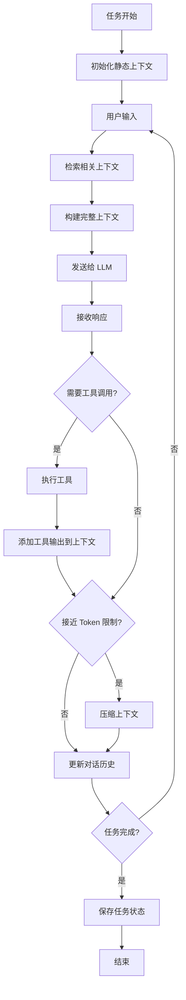
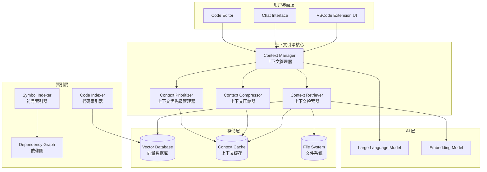

# AI 编程助手上下文引擎技术研究报告

> **作者**: Vlinder 开发团队  
> **日期**: 2025-10-07  
> **版本**: 1.0  
> **目标**: 为 Vlinder 设计和实现一个高效、智能的上下文引擎

---

## 目录

1. [概述](#1-概述)
2. [核心概念](#2-核心概念)
3. [业界最佳实践](#3-业界最佳实践)
4. [技术架构](#4-技术架构)
5. [具体实现方案](#5-具体实现方案)
6. [技术难点与解决方案](#6-技术难点与解决方案)
7. [实施路线图](#7-实施路线图)
8. [参考资料](#8-参考资料)

---

## 1. 概述

### 1.1 什么是上下文引擎？

**上下文引擎（Context Engine）** 是 AI 编程助手的核心组件，负责：

1. **收集**：从代码库、文件、对话历史、工具输出等来源收集信息
2. **管理**：在有限的 token 窗口内智能管理这些信息
3. **检索**：根据当前任务快速检索相关信息
4. **压缩**：当接近 token 限制时，智能压缩或删除不重要的信息
5. **提供**：将最相关的上下文提供给 LLM

### 1.2 为什么需要上下文引擎？

**核心挑战：**
- LLM 的上下文窗口有限（Claude 3.5 Sonnet: 200K tokens）
- 大型代码库可能有数百万行代码
- 对话历史会不断增长
- 工具输出可能非常冗长

**没有上下文引擎的后果：**
- ❌ AI 看不到相关代码，给出错误建议
- ❌ 对话很快达到 token 限制，必须重新开始
- ❌ AI 忘记之前的决策和上下文
- ❌ 用户体验差，效率低

**有上下文引擎的好处：**
- ✅ AI 始终能看到最相关的代码
- ✅ 长对话也能保持连贯性
- ✅ 智能压缩节省 token 和成本
- ✅ 更准确的代码建议和修改

### 1.3 上下文引擎的核心目标

1. **相关性最大化**：确保 AI 看到的都是与当前任务最相关的信息
2. **Token 效率**：在有限的 token 预算内提供最多的有用信息
3. **性能优化**：快速检索和压缩，不影响用户体验
4. **用户控制**：让用户能够控制 AI 能"看到"什么

---

## 2. 核心概念

### 2.1 Token 限制与上下文窗口

#### Token 的概念

- **Token** 是 LLM 处理文本的基本单位
- 英文：约 4 字符 = 1 token
- 中文：约 1-2 字符 = 1 token
- 代码：约 3-4 字符 = 1 token（取决于语言）

#### 主流模型的上下文窗口

| 模型 | 上下文窗口 | 输出限制 |
|------|-----------|---------|
| Claude 3.5 Sonnet | 200K tokens | 8K tokens |
| GPT-4 Turbo | 128K tokens | 4K tokens |
| GPT-4o | 128K tokens | 16K tokens |
| Gemini 1.5 Pro | 2M tokens | 8K tokens |

#### Token 分配策略

典型的 200K token 窗口分配：

```
系统提示（System Prompt）:        ~10K tokens  (5%)
项目结构和环境信息:                ~5K tokens   (2.5%)
相关文件内容:                      ~80K tokens  (40%)
对话历史:                          ~60K tokens  (30%)
工具输出:                          ~30K tokens  (15%)
当前任务描述:                      ~5K tokens   (2.5%)
预留缓冲:                          ~10K tokens  (5%)
```

### 2.2 上下文的类型

#### 1. 静态上下文（Static Context）

**特点**：在任务开始时确定，很少改变

**包含**：
- 系统提示（Agent 角色、工作流程、规则）
- 项目文件结构
- 环境信息（OS、Shell、工作目录）
- 自定义指令（Custom Instructions）

**示例**：
```xml
<environment_details>
  <os>Windows 11</os>
  <shell>PowerShell 7.4</shell>
  <cwd>C:\Users\User\Desktop\Vlinder</cwd>
  <project_structure>
    extension/
      src/
        agent/
        api/
        providers/
      webview-ui-vite/
        src/
          components/
          hooks/
  </project_structure>
</environment_details>
```

#### 2. 动态上下文（Dynamic Context）

**特点**：随着任务进行不断变化

**包含**：
- 对话历史（用户消息 + AI 响应）
- 工具调用和输出
- 文件修改历史
- 错误和警告信息

#### 3. 检索上下文（Retrieved Context）

**特点**：根据当前任务动态检索

**包含**：
- 相关文件内容
- 代码片段
- 文档片段
- 依赖关系

**检索方法**：
- 关键词搜索（Lexical Search）
- 语义搜索（Semantic Search / Vector Search）
- 混合搜索（Hybrid Search）

### 2.3 上下文的生命周期



---

## 3. 业界最佳实践

### 3.1 Cursor IDE

**核心特点**：
- 强大的代码理解能力
- 智能的上下文选择
- 快速的响应速度

**技术实现（推测）**：

#### 1. 代码索引系统
```typescript
// 伪代码
class CodeIndexer {
  // 使用 Tree-sitter 解析代码
  parseCode(filePath: string): AST {
    const parser = new TreeSitter();
    const tree = parser.parse(readFile(filePath));
    return tree;
  }
  
  // 提取符号（函数、类、变量）
  extractSymbols(ast: AST): Symbol[] {
    return ast.walk()
      .filter(node => isSymbol(node))
      .map(node => ({
        name: node.name,
        type: node.type,
        location: node.location,
        dependencies: findDependencies(node)
      }));
  }
  
  // 构建依赖图
  buildDependencyGraph(symbols: Symbol[]): Graph {
    const graph = new Graph();
    symbols.forEach(symbol => {
      graph.addNode(symbol);
      symbol.dependencies.forEach(dep => {
        graph.addEdge(symbol, dep);
      });
    });
    return graph;
  }
}
```

#### 2. 智能上下文选择
```typescript
class ContextSelector {
  selectRelevantFiles(
    currentFile: string,
    task: string,
    dependencyGraph: Graph
  ): File[] {
    // 1. 当前文件
    const files = [currentFile];
    
    // 2. 直接依赖
    const directDeps = dependencyGraph.getDirectDependencies(currentFile);
    files.push(...directDeps);
    
    // 3. 基于任务的语义搜索
    const semanticMatches = this.semanticSearch(task, this.codebase);
    files.push(...semanticMatches.slice(0, 5));
    
    // 4. 最近修改的文件
    const recentFiles = this.getRecentlyModifiedFiles(10);
    files.push(...recentFiles);
    
    // 去重并按相关性排序
    return this.deduplicateAndRank(files);
  }
}
```

### 3.2 Continue.dev（开源）

**核心特点**：
- 完全开源，可以学习实现细节
- 支持多种上下文提供者
- 灵活的配置系统

**关键实现**：

#### 1. Rules 系统
```markdown
# .continue/rules/architecture.md

## Project Architecture

This is a React application with:
- Components in `/src/components`
- API routes in `/src/api`
- State management using Redux in `/src/store`

## Coding Standards

- Use TypeScript for all new files
- Follow the existing naming conventions
- Write tests for all new features
```

#### 2. MCP (Model Context Protocol)
```typescript
// MCP Server 示例
class CodebaseMCPServer {
  async searchCode(query: string): Promise<SearchResult[]> {
    // 使用 ripgrep 进行快速搜索
    const results = await ripgrep(query, this.codebasePath);
    return results.map(r => ({
      file: r.file,
      line: r.line,
      content: r.content,
      context: this.getContext(r.file, r.line, 5)
    }));
  }
  
  async getFileContent(path: string): Promise<string> {
    return await fs.readFile(path, 'utf-8');
  }
  
  async listFiles(directory: string): Promise<string[]> {
    return await fs.readdir(directory, { recursive: true });
  }
}
```

### 3.3 GitHub Copilot

**核心特点**：
- 基于当前文件和打开的标签页
- 快速的内联补全
- 轻量级的上下文

**上下文策略**：
```typescript
class CopilotContext {
  getContext(): Context {
    return {
      // 当前文件的全部内容
      currentFile: this.getCurrentFileContent(),
      
      // 光标前后的代码
      cursorContext: {
        before: this.getTextBefore(cursor, 1000),
        after: this.getTextAfter(cursor, 1000)
      },
      
      // 打开的其他标签页（前 3 个）
      openTabs: this.getOpenTabs().slice(0, 3),
      
      // 最近编辑的文件
      recentEdits: this.getRecentEdits(5),
      
      // 项目语言和框架信息
      projectInfo: this.detectProjectType()
    };
  }
}
```

### 3.4 Windsurf (Codeium)

**核心特点**：
- Cascade 模式（多步骤规划）
- 智能的文件选择
- 上下文感知的代码生成

**Cascade 工作流**：
```
1. 理解任务 → 分析需求
2. 规划步骤 → 列出需要修改的文件
3. 收集上下文 → 读取相关文件
4. 执行修改 → 逐步实现
5. 验证结果 → 运行测试
```

---

## 4. 技术架构

### 4.1 整体架构



### 4.2 核心组件详解

#### 4.2.1 Context Manager（上下文管理器）

**职责**：
- 协调所有上下文相关操作
- 维护当前上下文状态
- 决定何时检索、压缩或更新上下文

**接口设计**：
```typescript
interface ContextManager {
  // 初始化上下文
  initialize(task: Task): Promise<Context>;
  
  // 添加用户消息
  addUserMessage(message: string): void;
  
  // 添加 AI 响应
  addAssistantMessage(message: string): void;
  
  // 添加工具输出
  addToolOutput(tool: string, output: string): void;
  
  // 获取当前上下文（用于发送给 LLM）
  getCurrentContext(): Context;
  
  // 检查是否需要压缩
  needsCompression(): boolean;
  
  // 执行压缩
  compress(): Promise<void>;
  
  // 保存上下文状态
  save(): Promise<void>;
  
  // 恢复上下文状态
  restore(taskId: string): Promise<void>;
}
```

**实现示例**：
```typescript
class ContextManagerImpl implements ContextManager {
  private staticContext: StaticContext;
  private conversationHistory: Message[] = [];
  private retrievedFiles: Map<string, FileContent> = new Map();
  private toolOutputs: ToolOutput[] = [];
  private currentTokenCount: number = 0;
  private maxTokens: number = 200000;
  
  async initialize(task: Task): Promise<Context> {
    // 1. 构建静态上下文
    this.staticContext = await this.buildStaticContext();
    
    // 2. 添加任务描述
    this.addUserMessage(task.description);
    
    // 3. 检索相关文件
    const relevantFiles = await this.retriever.retrieve(task.description);
    relevantFiles.forEach(file => {
      this.retrievedFiles.set(file.path, file);
    });
    
    // 4. 计算初始 token 数
    this.currentTokenCount = this.calculateTokens();
    
    return this.getCurrentContext();
  }
  
  getCurrentContext(): Context {
    return {
      systemPrompt: this.staticContext.systemPrompt,
      environment: this.staticContext.environment,
      files: Array.from(this.retrievedFiles.values()),
      conversation: this.conversationHistory,
      toolOutputs: this.toolOutputs,
      tokenCount: this.currentTokenCount
    };
  }
  
  needsCompression(): boolean {
    // 当使用超过 85% 的 token 时触发压缩
    return this.currentTokenCount > this.maxTokens * 0.85;
  }
  
  async compress(): Promise<void> {
    // 1. 压缩对话历史
    this.conversationHistory = await this.compressor.compressConversation(
      this.conversationHistory
    );
    
    // 2. 压缩工具输出
    this.toolOutputs = await this.compressor.compressToolOutputs(
      this.toolOutputs
    );
    
    // 3. 移除不相关的文件
    const relevantFiles = await this.prioritizer.rankFiles(
      Array.from(this.retrievedFiles.values()),
      this.conversationHistory
    );
    
    // 只保留前 50% 最相关的文件
    const filesToKeep = relevantFiles.slice(0, Math.ceil(relevantFiles.length / 2));
    this.retrievedFiles = new Map(
      filesToKeep.map(f => [f.path, f])
    );
    
    // 4. 重新计算 token 数
    this.currentTokenCount = this.calculateTokens();
  }
}
```

#### 4.2.2 Context Retriever（上下文检索器）

**职责**：
- 根据查询检索相关代码
- 支持多种检索策略
- 返回排序后的结果

**检索策略**：

1. **关键词搜索（Lexical Search）**
   - 使用 ripgrep 进行快速文本搜索
   - 适合查找特定函数名、类名、变量名
   - 速度快，但不理解语义

2. **语义搜索（Semantic Search）**
   - 使用嵌入模型将代码转换为向量
   - 在向量空间中查找相似代码
   - 理解语义，但速度较慢

3. **混合搜索（Hybrid Search）**
   - 结合关键词和语义搜索
   - 平衡速度和准确性

**实现示例**：
```typescript
class ContextRetriever {
  private vectorDB: VectorDatabase;
  private codeIndexer: CodeIndexer;
  
  async retrieve(query: string, limit: number = 10): Promise<FileContent[]> {
    // 1. 关键词搜索
    const lexicalResults = await this.lexicalSearch(query);
    
    // 2. 语义搜索
    const semanticResults = await this.semanticSearch(query);
    
    // 3. 合并和重排序
    const combined = this.mergeResults(lexicalResults, semanticResults);
    
    // 4. 返回前 N 个结果
    return combined.slice(0, limit);
  }
  
  private async lexicalSearch(query: string): Promise<SearchResult[]> {
    // 使用 ripgrep 搜索
    const results = await ripgrep(query, this.codebasePath, {
      maxResults: 50,
      contextLines: 5
    });
    
    return results.map(r => ({
      file: r.file,
      score: this.calculateLexicalScore(r, query),
      content: r.content,
      type: 'lexical'
    }));
  }
  
  private async semanticSearch(query: string): Promise<SearchResult[]> {
    // 1. 将查询转换为向量
    const queryEmbedding = await this.embedModel.embed(query);
    
    // 2. 在向量数据库中搜索
    const results = await this.vectorDB.search(queryEmbedding, {
      limit: 50,
      threshold: 0.7  // 相似度阈值
    });
    
    return results.map(r => ({
      file: r.metadata.file,
      score: r.similarity,
      content: r.metadata.content,
      type: 'semantic'
    }));
  }
  
  private mergeResults(
    lexical: SearchResult[],
    semantic: SearchResult[]
  ): FileContent[] {
    // 使用 Reciprocal Rank Fusion (RRF) 算法合并结果
    const k = 60;  // RRF 参数
    const scores = new Map<string, number>();
    
    lexical.forEach((result, index) => {
      const score = 1 / (k + index + 1);
      scores.set(result.file, (scores.get(result.file) || 0) + score);
    });
    
    semantic.forEach((result, index) => {
      const score = 1 / (k + index + 1);
      scores.set(result.file, (scores.get(result.file) || 0) + score);
    });
    
    // 按分数排序
    return Array.from(scores.entries())
      .sort((a, b) => b[1] - a[1])
      .map(([file, score]) => ({
        path: file,
        content: this.loadFileContent(file),
        score
      }));
  }
}
```

#### 4.2.3 Context Compressor（上下文压缩器）

**职责**：
- 压缩对话历史
- 压缩工具输出
- 保留关键信息

**压缩策略**：

1. **对话历史压缩**
   - 保留最近的 N 条消息（完整）
   - 对旧消息进行摘要
   - 保留关键决策点

2. **工具输出压缩**
   - 压缩长输出（如大文件内容）
   - 保留错误信息
   - 删除重复信息

3. **文件内容压缩**
   - 只保留相关的函数/类
   - 删除注释和空行
   - 保留接口定义

**实现示例**：
```typescript
class ContextCompressor {
  private llm: LLM;

  async compressConversation(messages: Message[]): Promise<Message[]> {
    // 1. 保留最近的 8 条消息
    const recentMessages = messages.slice(-8);
    const oldMessages = messages.slice(0, -8);

    if (oldMessages.length === 0) {
      return recentMessages;
    }

    // 2. 对旧消息进行摘要
    const summary = await this.summarizeMessages(oldMessages);

    // 3. 创建摘要消息
    const summaryMessage: Message = {
      role: 'user',
      content: `<conversation_summary>
Previous conversation summary:
${summary}
</conversation_summary>`
    };

    return [summaryMessage, ...recentMessages];
  }

  private async summarizeMessages(messages: Message[]): Promise<string> {
    const prompt = `Summarize the following conversation, focusing on:
1. Key decisions made
2. Files that were modified
3. Important context that should be remembered

Conversation:
${messages.map(m => `${m.role}: ${m.content}`).join('\n\n')}

Summary:`;

    const response = await this.llm.complete(prompt, {
      maxTokens: 1000,
      temperature: 0.3
    });

    return response.text;
  }

  async compressToolOutputs(outputs: ToolOutput[]): Promise<ToolOutput[]> {
    return Promise.all(outputs.map(async output => {
      // 如果输出很短，不压缩
      if (output.content.length < 5000) {
        return output;
      }

      // 根据工具类型选择压缩策略
      switch (output.tool) {
        case 'read_file':
          return this.compressFileContent(output);
        case 'execute_command':
          return this.compressCommandOutput(output);
        case 'search_files':
          return this.compressSearchResults(output);
        default:
          return this.genericCompress(output);
      }
    }));
  }

  private compressFileContent(output: ToolOutput): ToolOutput {
    // 只保留函数签名和类定义
    const ast = parseCode(output.content);
    const signatures = extractSignatures(ast);

    return {
      ...output,
      content: `[File content compressed]
Functions and classes:
${signatures.join('\n')}

Full content available if needed.`,
      compressed: true
    };
  }

  private compressCommandOutput(output: ToolOutput): ToolOutput {
    const lines = output.content.split('\n');

    // 保留前 50 行和后 50 行
    if (lines.length > 200) {
      const start = lines.slice(0, 50).join('\n');
      const end = lines.slice(-50).join('\n');

      return {
        ...output,
        content: `${start}

[... ${lines.length - 100} lines compressed ...]

${end}`,
        compressed: true
      };
    }

    return output;
  }
}
```

#### 4.2.4 Context Prioritizer（上下文优先级管理器）

**职责**：
- 评估每个上下文项的重要性
- 决定保留或删除哪些内容
- 动态调整优先级

**优先级因素**：

1. **时间因素**
   - 最近访问的文件优先级更高
   - 最近的对话优先级更高

2. **相关性因素**
   - 与当前任务相关的文件优先级更高
   - 被多次引用的文件优先级更高

3. **依赖关系**
   - 被当前文件依赖的文件优先级更高
   - 核心模块优先级更高

4. **用户标记**
   - 用户明确标记的文件（InterestedFiles）优先级最高

**实现示例**：
```typescript
class ContextPrioritizer {
  async rankFiles(
    files: FileContent[],
    conversation: Message[]
  ): Promise<FileContent[]> {
    // 计算每个文件的分数
    const scores = await Promise.all(
      files.map(file => this.calculateFileScore(file, conversation))
    );

    // 按分数排序
    const ranked = files
      .map((file, index) => ({ file, score: scores[index] }))
      .sort((a, b) => b.score - a.score);

    return ranked.map(r => r.file);
  }

  private async calculateFileScore(
    file: FileContent,
    conversation: Message[]
  ): Promise<number> {
    let score = 0;

    // 1. 时间因素（0-20 分）
    const timeSinceAccess = Date.now() - file.lastAccessTime;
    const timeScore = Math.max(0, 20 - timeSinceAccess / (1000 * 60 * 5));
    score += timeScore;

    // 2. 引用次数（0-30 分）
    const referenceCount = this.countReferences(file.path, conversation);
    const referenceScore = Math.min(30, referenceCount * 5);
    score += referenceScore;

    // 3. 依赖关系（0-20 分）
    const dependencyScore = this.calculateDependencyScore(file);
    score += dependencyScore;

    // 4. 用户标记（0-30 分）
    if (file.isInterestedFile) {
      score += 30;
    }

    // 5. 语义相关性（0-20 分）
    const lastUserMessage = conversation
      .filter(m => m.role === 'user')
      .slice(-1)[0];

    if (lastUserMessage) {
      const semanticScore = await this.calculateSemanticSimilarity(
        file.content,
        lastUserMessage.content
      );
      score += semanticScore * 20;
    }

    return score;
  }

  private countReferences(filePath: string, conversation: Message[]): number {
    let count = 0;
    const fileName = path.basename(filePath);

    conversation.forEach(message => {
      if (message.content.includes(filePath) ||
          message.content.includes(fileName)) {
        count++;
      }
    });

    return count;
  }

  private calculateDependencyScore(file: FileContent): number {
    // 被依赖次数越多，分数越高
    const dependentCount = this.dependencyGraph.getDependentCount(file.path);
    return Math.min(20, dependentCount * 2);
  }
}
```

---

## 5. 具体实现方案

### 5.1 InterestedFiles 系统（Phase 1）

这是最基础、最实用的功能，应该首先实现。

#### 5.1.1 数据结构

```typescript
// extension/src/agent/v1/types/index.ts
export interface InterestedFile {
  path: string;           // 文件的绝对路径
  why: string;            // 为什么这个文件重要
  createdAt: number;      // 添加时间
  priority: number;       // 优先级（0-100）
  isPinned: boolean;      // 是否被用户固定
  lastAccessTime: number; // 最后访问时间
}

export interface AgentState {
  taskId: string;
  apiConversationHistory: MessageParam[];
  claudeMessages: ClaudeMessage[];
  interestedFiles: InterestedFile[];  // 新增
  historyErrors: Record<string, any>;
}
```

#### 5.1.2 StateManager 扩展

```typescript
// extension/src/agent/v1/state-manager/index.ts
export class StateManager {
  // ... 现有代码 ...

  public addInterestedFile(file: Omit<InterestedFile, 'createdAt' | 'lastAccessTime'>): void {
    if (!this._state.interestedFiles) {
      this._state.interestedFiles = [];
    }

    // 检查是否已存在
    const existingIndex = this._state.interestedFiles.findIndex(
      f => f.path === file.path
    );

    if (existingIndex >= 0) {
      // 更新现有文件
      this._state.interestedFiles[existingIndex] = {
        ...this._state.interestedFiles[existingIndex],
        ...file,
        lastAccessTime: Date.now()
      };
    } else {
      // 添加新文件
      this._state.interestedFiles.push({
        ...file,
        createdAt: Date.now(),
        lastAccessTime: Date.now()
      });
    }

    // 持久化
    this._ioManager.saveInterestedFiles(this._state.interestedFiles);
  }

  public removeInterestedFile(path: string): void {
    if (this._state.interestedFiles) {
      this._state.interestedFiles = this._state.interestedFiles.filter(
        f => f.path !== path
      );
      this._ioManager.saveInterestedFiles(this._state.interestedFiles);
    }
  }

  public getInterestedFiles(): InterestedFile[] {
    return this._state.interestedFiles || [];
  }

  public updateFileAccess(path: string): void {
    const file = this._state.interestedFiles?.find(f => f.path === path);
    if (file) {
      file.lastAccessTime = Date.now();
      this._ioManager.saveInterestedFiles(this._state.interestedFiles);
    }
  }
}
```

#### 5.1.3 Tool Runner 实现

```typescript
// extension/src/agent/v1/tools/runners/add-interested-file.tool.ts
import { BaseAgentTool } from '../base-agent.tool';
import { AddInterestedFileToolParams } from '../schema/add_interested_file';
import * as path from 'path';
import * as fs from 'fs';

export class AddInterestedFileTool extends BaseAgentTool<AddInterestedFileToolParams> {
  async execute() {
    const { input, say } = this.params;
    const { path: relPath, why } = input;

    if (!relPath || !why) {
      await say('error', 'Missing required parameters: path and why');
      return this.toolResponse('error', 'Both path and why parameters are required');
    }

    try {
      // 解析为绝对路径
      const absolutePath = path.resolve(this.cwd, relPath);

      // 检查文件是否存在
      if (!fs.existsSync(absolutePath)) {
        return this.toolResponse('error', `File not found: ${relPath}`);
      }

      // 添加到 interested files
      this.MainAgent.getStateManager().addInterestedFile({
        path: absolutePath,
        why,
        priority: 50,  // 默认优先级
        isPinned: false
      });

      await say('tool', `Tracked file: ${relPath}\nReason: ${why}`);

      return this.toolResponse('success', `File tracked successfully: ${relPath}`);
    } catch (error) {
      return this.toolResponse('error', `Failed to track file: ${error.message}`);
    }
  }
}
```

#### 5.1.4 集成到系统提示

```typescript
// extension/src/agent/v1/prompts/main.prompt.ts
export function buildSystemPrompt(config: PromptConfig): string {
  const stateManager = config.stateManager;
  const interestedFiles = stateManager.getInterestedFiles();

  let prompt = basePrompt;

  // 添加 interested files 信息
  if (interestedFiles.length > 0) {
    prompt += `\n\n# INTERESTED FILES

You have marked the following files as relevant to the current task:

${interestedFiles.map(f => `
<interested_file>
  <path>${f.path}</path>
  <why>${f.why}</why>
  <priority>${f.priority}</priority>
</interested_file>
`).join('\n')}

These files should be considered when making decisions and suggestions.
You can use the read_file tool to view their contents if needed.
`;
  }

  return prompt;
}
```

---

## 6. 技术难点与解决方案

### 6.1 Token 计数的准确性

**问题**：
- 不同模型的 tokenizer 不同
- 字符数估算不准确
- 特殊字符和代码的 token 数难以预测

**解决方案**：

1. **使用官方 Tokenizer**
```typescript
import { encode } from 'gpt-tokenizer';  // 或 @anthropic-ai/tokenizer

function countTokens(text: string): number {
  return encode(text).length;
}
```

2. **缓存 Token 计数**
```typescript
class TokenCounter {
  private cache = new Map<string, number>();

  count(text: string): number {
    const hash = this.hash(text);

    if (this.cache.has(hash)) {
      return this.cache.get(hash)!;
    }

    const count = encode(text).length;
    this.cache.set(hash, count);
    return count;
  }

  private hash(text: string): string {
    // 使用快速哈希算法
    return crypto.createHash('md5').update(text).digest('hex');
  }
}
```

3. **预留安全边界**
```typescript
const SAFETY_MARGIN = 0.15;  // 15% 安全边界
const effectiveMaxTokens = maxTokens * (1 - SAFETY_MARGIN);
```

### 6.2 压缩质量保证

**问题**：
- 压缩可能丢失重要信息
- 摘要可能不准确
- 用户可能需要被压缩的信息

**解决方案**：

1. **保留关键信息**
```typescript
class SmartCompressor {
  async compress(messages: Message[]): Promise<Message[]> {
    // 1. 识别关键消息
    const keyMessages = this.identifyKeyMessages(messages);

    // 2. 对非关键消息进行摘要
    const nonKeyMessages = messages.filter(m => !keyMessages.includes(m));
    const summary = await this.summarize(nonKeyMessages);

    // 3. 合并
    return [summary, ...keyMessages];
  }

  private identifyKeyMessages(messages: Message[]): Message[] {
    return messages.filter(m =>
      // 包含错误信息
      m.content.includes('error') ||
      m.content.includes('Error') ||
      // 包含决策
      m.content.includes('decided') ||
      m.content.includes('chose') ||
      // 包含文件修改
      m.content.includes('modified') ||
      m.content.includes('created') ||
      // 最近的消息
      messages.indexOf(m) >= messages.length - 5
    );
  }
}
```

2. **允许恢复**
```typescript
class ContextManager {
  private compressionHistory: CompressionSnapshot[] = [];

  async compress(): Promise<void> {
    // 保存压缩前的快照
    this.compressionHistory.push({
      timestamp: Date.now(),
      context: this.cloneContext()
    });

    // 执行压缩
    await this.compressor.compress(this.context);

    // 限制历史记录数量
    if (this.compressionHistory.length > 5) {
      this.compressionHistory.shift();
    }
  }

  async rollback(steps: number = 1): Promise<void> {
    if (this.compressionHistory.length < steps) {
      throw new Error('Not enough compression history');
    }

    const snapshot = this.compressionHistory[this.compressionHistory.length - steps];
    this.context = snapshot.context;
  }
}
```

### 6.3 性能优化

**问题**：
- 向量搜索可能很慢
- 大文件解析耗时
- 频繁的 I/O 操作

**解决方案**：

1. **异步和并行处理**
```typescript
class ContextRetriever {
  async retrieve(query: string): Promise<FileContent[]> {
    // 并行执行多种搜索
    const [lexical, semantic, dependency] = await Promise.all([
      this.lexicalSearch(query),
      this.semanticSearch(query),
      this.dependencySearch(query)
    ]);

    return this.mergeResults(lexical, semantic, dependency);
  }
}
```

2. **缓存策略**
```typescript
class CachedRetriever {
  private cache = new LRUCache<string, FileContent[]>({
    max: 100,
    ttl: 1000 * 60 * 5  // 5 分钟
  });

  async retrieve(query: string): Promise<FileContent[]> {
    const cacheKey = this.getCacheKey(query);

    if (this.cache.has(cacheKey)) {
      return this.cache.get(cacheKey)!;
    }

    const results = await this.actualRetrieve(query);
    this.cache.set(cacheKey, results);
    return results;
  }
}
```

3. **增量索引**
```typescript
class IncrementalIndexer {
  private fileWatcher: FSWatcher;

  async initialize(): Promise<void> {
    // 初始索引
    await this.indexAll();

    // 监听文件变化
    this.fileWatcher = fs.watch(this.projectPath, { recursive: true });

    this.fileWatcher.on('change', async (eventType, filename) => {
      if (eventType === 'change') {
        await this.reindexFile(filename);
      }
    });
  }

  private async reindexFile(filename: string): Promise<void> {
    // 只重新索引变化的文件
    const content = await fs.readFile(filename, 'utf-8');
    const chunks = await this.chunkFile(content, filename);

    // 删除旧的索引
    await this.vectorDB.delete({ file: filename });

    // 添加新的索引
    await this.vectorDB.add(chunks);
  }
}
```

### 6.4 用户体验

**问题**：
- 用户不知道 AI 能"看到"什么
- 压缩过程可能让用户困惑
- 缺乏控制感

**解决方案**：

1. **可视化上下文**
```typescript
// 在 UI 中显示当前上下文
interface ContextVisualization {
  totalTokens: number;
  maxTokens: number;
  breakdown: {
    systemPrompt: number;
    files: number;
    conversation: number;
    toolOutputs: number;
  };
  files: Array<{
    path: string;
    tokens: number;
    isInterestedFile: boolean;
  }>;
}
```

2. **压缩通知**
```typescript
class ContextManager {
  async compress(): Promise<void> {
    // 通知用户压缩开始
    await this.notifyUser({
      type: 'compression_started',
      message: 'Context is getting full. Compressing old messages...'
    });

    await this.compressor.compress(this.context);

    // 通知用户压缩完成
    await this.notifyUser({
      type: 'compression_completed',
      message: 'Compression complete. Context size reduced by 40%.'
    });
  }
}
```

3. **用户控制**
```typescript
// 允许用户手动管理上下文
interface ContextControls {
  // 查看当前上下文
  viewContext(): ContextVisualization;

  // 手动添加文件
  addFile(path: string, why: string): void;

  // 移除文件
  removeFile(path: string): void;

  // 固定重要文件（不会被压缩删除）
  pinFile(path: string): void;

  // 手动触发压缩
  compress(): Promise<void>;

  // 清除上下文（重新开始）
  clear(): void;
}
```

---

## 7. 实施路线图

### Phase 1: 基础上下文管理（2-3 周）

**目标**：实现 InterestedFiles 系统和基本的上下文管理

**任务**：
1. ✅ 扩展 `AgentState` 添加 `interestedFiles`
2. ✅ 实现 `StateManager` 的 add/remove/get 方法
3. ✅ 实现 `IOManager` 的持久化方法
4. ✅ 实现 `AddInterestedFileTool` runner
5. ✅ 实现 `WebviewManager` 消息处理
6. ✅ 实现前端 `use-interested-files` hook
7. ✅ 实现前端 `InterestedFilesTabs` 组件
8. ✅ 集成到系统提示
9. ✅ 测试和调试

**验收标准**：
- AI 可以使用 `add_interested_file` 工具标记文件
- 用户可以在 UI 中看到 interested files
- 用户可以手动添加/删除文件
- Interested files 信息包含在系统提示中
- 文件列表持久化保存

### Phase 2: 智能压缩（2-3 周）

**目标**：实现智能的上下文压缩系统

**任务**：
1. ✅ 实现 `IntelligentCompressor` 类
2. ✅ 实现对话历史摘要
3. ✅ 实现工具输出压缩
4. ✅ 实现文件内容压缩
5. ✅ 集成到 `ContextManager`
6. ✅ 添加压缩通知 UI
7. ✅ 实现压缩历史和回滚
8. ✅ 测试压缩质量

**验收标准**：
- 当接近 token 限制时自动触发压缩
- 压缩后 token 数减少至少 30%
- 关键信息不丢失
- 用户收到压缩通知
- 可以回滚压缩

### Phase 3: 语义检索（3-4 周）

**目标**：实现基于向量的语义检索系统

**任务**：
1. ✅ 选择并集成向量数据库（ChromaDB/LanceDB）
2. ✅ 选择并集成嵌入模型
3. ✅ 实现 `CodeIndexer` 类
4. ✅ 实现代码分块策略
5. ✅ 实现增量索引
6. ✅ 实现 `ContextRetriever` 类
7. ✅ 实现混合搜索（关键词 + 语义）
8. ✅ 优化检索性能
9. ✅ 测试检索准确性

**验收标准**：
- 代码库完全索引
- 语义搜索返回相关结果
- 混合搜索优于单一策略
- 检索速度 < 1 秒
- 支持增量更新

### Phase 4: 高级功能（2-3 周）

**目标**：实现上下文优先级管理和高级功能

**任务**：
1. ✅ 实现 `ContextPrioritizer` 类
2. ✅ 实现文件评分算法
3. ✅ 实现依赖关系分析
4. ✅ 实现上下文可视化 UI
5. ✅ 实现用户控制面板
6. ✅ 优化整体性能
7. ✅ 完善文档
8. ✅ 全面测试

**验收标准**：
- 文件按相关性自动排序
- 不重要的文件自动移除
- 用户可以查看当前上下文
- 用户可以手动控制上下文
- 系统稳定可靠

---

## 8. 参考资料

### 8.1 开源项目

1. **Continue.dev**
   - GitHub: https://github.com/continuedev/continue
   - 文档: https://docs.continue.dev/
   - 重点学习: Rules 系统、MCP 实现

2. **Cody (Sourcegraph)**
   - GitHub: https://github.com/sourcegraph/cody
   - 文档: https://sourcegraph.com/docs/cody
   - 重点学习: 代码图谱、上下文检索

3. **LangChain**
   - GitHub: https://github.com/langchain-ai/langchain
   - 文档: https://python.langchain.com/
   - 重点学习: RAG 实现、向量存储

### 8.2 技术文档

1. **Anthropic Claude**
   - 文档: https://docs.anthropic.com/
   - 重点: Prompt Caching、长上下文处理

2. **OpenAI**
   - 文档: https://platform.openai.com/docs
   - 重点: Embeddings API、Token 计数

3. **ChromaDB**
   - 文档: https://docs.trychroma.com/
   - 重点: 向量存储、检索优化

### 8.3 学术论文

1. **RAG (Retrieval-Augmented Generation)**
   - "Retrieval-Augmented Generation for Knowledge-Intensive NLP Tasks"
   - Lewis et al., 2020

2. **Code Embeddings**
   - "CodeBERT: A Pre-Trained Model for Programming and Natural Languages"
   - Feng et al., 2020

3. **Context Compression**
   - "LongLLMLingua: Accelerating and Enhancing LLMs in Long Context Scenarios"
   - Jiang et al., 2023

### 8.4 博客文章

1. **Cursor 的上下文管理**
   - https://www.cursor.com/blog/context-management

2. **Continue.dev 的 RAG 实现**
   - https://blog.continue.dev/rag-codebase

3. **LLM 上下文工程**
   - https://www.anthropic.com/engineering/context-engineering

---

## 总结

上下文引擎是 AI 编程助手的核心，决定了 AI 的"智能"程度。一个好的上下文引擎应该：

1. **智能**：自动识别和检索相关信息
2. **高效**：在有限的 token 预算内提供最多的有用信息
3. **可控**：让用户能够控制 AI 能"看到"什么
4. **可靠**：不丢失关键信息，压缩质量有保证

**实施建议**：

1. **从简单开始**：先实现 InterestedFiles 系统（Phase 1）
2. **逐步优化**：然后添加智能压缩（Phase 2）
3. **高级功能**：最后实现语义检索（Phase 3）和优先级管理（Phase 4）
4. **持续改进**：根据用户反馈不断优化

**关键成功因素**：

1. **准确的 Token 计数**：使用官方 tokenizer
2. **智能的压缩策略**：保留关键信息
3. **快速的检索**：缓存和并行处理
4. **良好的用户体验**：可视化和控制

祝您实现成功！🚀

