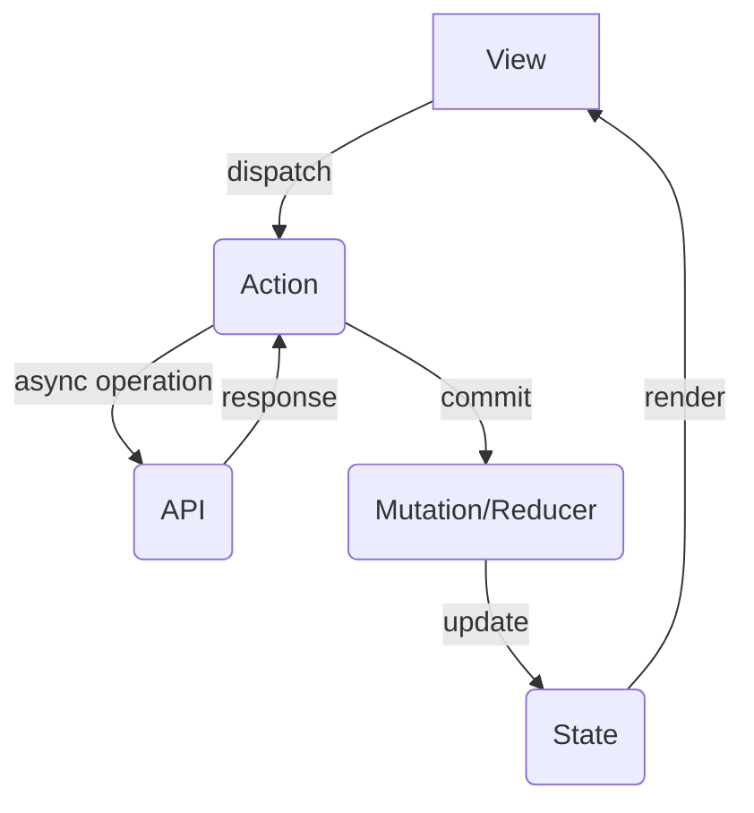

# 节点编辑功能右键菜单Text文本框修复总结

## 问题描述
修复节点编辑功能的右键菜单Text文本框包含结构体的问题，例如 `hexNewCircle{{New Circle}}` 的Text文本框包含 `{New Circle`，实际应该为 `New Circle`。

## 根本原因分析
问题的根本原因是**正则表达式匹配顺序错误**：

1. **Diamond模式优先匹配**: Diamond模式 `\{([^}]*)\}` 会先匹配到 `{{New Circle}}` 中的第一个 `{` 和第一个 `}`
2. **结果**: 匹配到 `{New Circle` (包含第二个 `{` 但在第一个 `}` 处停止)
3. **应该**: Hexagon模式 `\{\{([^}]*)\}\}` 应该优先匹配，提取出 `New Circle`

## 修复方案
调整正则表达式的匹配顺序，让更具体的模式优先于更通用的模式：

### 修复前的顺序问题
```javascript
// 错误的顺序
`(?:\\{([^}]*)\\})|` +                      // Diamond: {text} - 先匹配
`(?:\\{\\{([^}]*)\\}\\})|` +                // Hexagon: {{text}} - 后匹配
```

### 修复后的正确顺序
```javascript
// 正确的顺序
`(?:\\{\\{([^}]*)\\}\\})|` +                // Hexagon: {{text}} - 先匹配
`(?:\\{([^}]*)\\})|` +                      // Diamond: {text} - 后匹配
```

## 修复的文件和函数

### 1. `use-node-operations.ts` - `getNodeDetails` 函数
- **位置**: `webview-ui-vite/src/components/dna-context-protocol/hooks/use-node-operations.ts`
- **修复**: 重新排序正则表达式模式，确保更具体的模式优先匹配
- **影响**: 修复右键菜单Text字段的文本提取

### 2. `use-node-operations.ts` - `editNodeText` 函数  
- **位置**: 同上文件
- **修复**: 调整替换模式的顺序，与 `getNodeDetails` 保持一致
- **影响**: 确保文本编辑功能正常工作

## 完整的模式优先级顺序

修复后的正则表达式按以下优先级排序：

1. **带引号的模式** (最具体)
   - `["text"]` - Rectangle with quotes
   - `("text")` - Rounded with quotes

2. **多层嵌套模式** (具体 → 通用)
   - `(((text)))` - Double Circle (优先于Circle和Rounded)
   - `((text))` - Circle (优先于Rounded)
   - `([text])` - Stadium (优先于Rounded)

3. **特殊括号组合** (优先于基本模式)
   - `[(text)]` - Cylindrical (优先于Rectangle)
   - `[[text]]` - Subroutine (优先于Rectangle)
   - `[/text/]` - Parallelogram (优先于Rectangle)
   - `[/text\]` - Trapezoid (优先于Rectangle)

4. **基本模式** (最后匹配)
   - `[text]` - Rectangle
   - `(text)` - Rounded

5. **大括号模式** (具体 → 通用)
   - `{{text}}` - Hexagon (优先于Diamond) ⭐ **主要修复点**
   - `{text}` - Diamond

6. **其他模式**
   - `>text>` - Label

## 测试验证

修复后所有节点类型都能正确提取文本：

- ✅ Hexagon: `hexNewCircle{{New Circle}}` → `"New Circle"` (主要修复目标)
- ✅ Rectangle: `A[Rectangle Text]` → `"Rectangle Text"`
- ✅ Rounded: `B(Rounded Text)` → `"Rounded Text"`
- ✅ Diamond: `C{Diamond Text}` → `"Diamond Text"`
- ✅ Circle: `D((Circle Text))` → `"Circle Text"`
- ✅ Double Circle: `E(((Double Circle Text)))` → `"Double Circle Text"`
- ✅ Stadium: `F([Stadium Text])` → `"Stadium Text"`
- ✅ Subroutine: `G[[Subroutine Text]]` → `"Subroutine Text"`
- ✅ Cylindrical: `H[(Cylindrical Text)]` → `"Cylindrical Text"`
- ✅ Parallelogram: `I[/Parallelogram Text/]` → `"Parallelogram Text"`
- ✅ Trapezoid: `J[/Trapezoid Text\]` → `"Trapezoid Text"`
- ✅ Label: `K>Label Text>` → `"Label Text"`

## 影响范围

- ✅ **右键菜单文本显示**: 所有节点类型的Text字段现在都能正确显示纯文本内容
- ✅ **文本编辑功能**: 修改文本后能正确更新到Code Editor中
- ✅ **节点结构保持**: 编辑文本时节点的形状和结构符号保持不变
- ✅ **向后兼容**: 修复不影响现有功能，只是改进了文本提取的准确性

## 关键学习点

1. **正则表达式顺序很重要**: 在使用多个可选模式时，更具体的模式必须放在更通用的模式之前
2. **一致性原则**: 文本提取和文本编辑的正则表达式顺序必须保持一致
3. **全面测试**: 修复一个问题时要确保不会破坏其他功能

## 后续发现的Stadium节点转义问题

### 🐛 新问题
用户反馈：`stadiumNewCircle([Code Editor])` 的Text文本框显示 `[Code Editor]` 而不是 `Code Editor`

### 🔍 根本原因
**JavaScript字符串转义问题**：
- **错误的转义**: `[^\]]+` 在JavaScript字符串中实际上是 `[^]+`（匹配任何字符）
- **正确的转义**: `[^\\]]+` 在JavaScript字符串中才是 `[^\]]+`（匹配除了 `]` 之外的字符）

### 🔧 修复内容
修复了以下正则表达式中的转义问题：

1. **Stadium模式**: `(?:\\(\\[([^\]]+)\\]\\))` → `(?:\\(\\[([^\\]]+)\\]\\))`
2. **Subroutine模式**: `(?:\\[\\[([^\]]+)\\]\\])` → `(?:\\[\\[([^\\]]+)\\]\\])`
3. **Rectangle模式**: `(?:\\[([^\]]*)\])` → `(?:\\[([^\\]]*)\])`

### ✅ 修复验证
- ✅ Stadium: `stadiumNewCircle([Code Editor])` → 正确提取 `"Code Editor"`
- ✅ Rectangle: `A[Rectangle Text]` → 正确提取 `"Rectangle Text"`
- ✅ Subroutine: `G[[Subroutine Text]]` → 正确提取 `"Subroutine Text"`

### 📊 修复前后对比
- **修复前**: `[^\]]+` → 匹配结果 `"[Code Editor]"` ❌
- **修复后**: `[^\\]]+` → 匹配结果 `"Code Editor"` ✅

## 第三个问题：空文本节点显示问题

### 🐛 新发现的问题
用户反馈：`rectNewRectangle`、`imgNewCircle`、`subNewCircle` 等节点的右键菜单Text文本框显示为空

### 🔍 根本原因分析
**空文本处理逻辑问题**：
1. **空内容节点**：如 `rectNewRectangle[]`、`imgNewCircle(())`、`subNewCircle[[]]`
2. **错误的回退逻辑**：当提取到空字符串时，`|| nodeId` 不生效（空字符串是falsy但在逻辑或中被当作truthy）
3. **正则表达式量词问题**：使用 `+`（一个或多个）而不是 `*`（零个或多个），导致空内容不匹配

### 🔧 修复内容

#### 1. 修复空文本回退逻辑
```typescript
// 修复前（有问题）
nodeText = (
  match[1] || match[2] || ... || nodeId
).trim();

// 修复后（正确）
const extractedText = (
  match[1] || match[2] || ... || ""
).trim();
nodeText = extractedText || nodeId; // 空字符串时回退到nodeId
```

#### 2. 修复正则表达式量词
```typescript
// 修复前：使用 + (一个或多个)
`(?:\\[\\[([^\\]]+)\\]\\])|` +               // Subroutine: 不匹配空内容
`(?:\\(\\[([^\\]]+)\\]\\))|` +               // Stadium: 不匹配空内容

// 修复后：使用 * (零个或多个)
`(?:\\[\\[([^\\]]*)\\]\\])|` +               // Subroutine: 匹配空内容
`(?:\\(\\[([^\\]]*)\\]\\))|` +               // Stadium: 匹配空内容
```

### ✅ 修复验证
- ✅ 空Rectangle: `rectNewRectangle[]` → 正确显示 `"rectNewRectangle"`
- ✅ 空Circle: `imgNewCircle(())` → 正确显示 `"imgNewCircle"`
- ✅ 空Subroutine: `subNewCircle[[]]` → 正确显示 `"subNewCircle"`
- ✅ 空Hexagon: `hexNewCircle{{}}` → 正确显示 `"hexNewCircle"`
- ✅ 正常文本：所有正常节点仍然正确工作

### 📊 最终效果
现在所有节点类型的右键菜单Text文本框都能正确显示：
- **有内容的节点**：显示纯文本内容（移除结构符号和图标）
- **空内容的节点**：显示节点ID作为回退文本
- **所有节点类型**：Rectangle、Circle、Subroutine、Stadium、Hexagon等全部支持

## 第四个问题：Edge模式右键菜单Outgoing Connections识别问题

### 🐛 问题描述
Edge模式的右键菜单中的Outgoing Connections无法识别 `A -- 标签 --> B` 格式的连线，导致右键菜单显示为空。

### 📋 问题示例


### 🔍 根本原因分析
**边缘解析正则表达式不完整**：
- `use-edge-manager.ts` 中的边缘解析逻辑只支持标准格式：
  - `A -->|标签| B` (管道标签格式)
  - `A --> B` (无标签格式)
- **缺失支持**：`A -- 标签 --> B` (破折号标签格式)

### 🔧 修复内容

#### 1. 修复边缘解析逻辑 (use-edge-manager.ts)
在 `parseAndIndexEdges`、`changeEdgeType`、`colorEdge` 函数中添加对破折号标签格式的支持：

```typescript
// 新增：支持 A -- 标签 --> B 格式
const dashLabelRegex = new RegExp(
  `^${captureNodePattern}\\s*--\\s*([^-]+)\\s*-->\\s*${captureNodePattern}`
);

// 修改匹配逻辑
const dashLabelMatch = trimmedLine.match(dashLabelRegex);
if (dashLabelMatch) {
  sourceDef = dashLabelMatch[1];
  targetDef = dashLabelMatch[3];
  // 标签在 dashLabelMatch[2]
}
```

#### 2. 确保边缘编辑器支持 (use-edge-editor.ts)
验证并确认 `parseEdgeLabel` 和 `updateEdgeLabel` 函数已支持破折号标签格式。

### ✅ 修复验证
测试用例：6条连线全部正确识别
- ✅ `A[View] -- dispatch --> B(Action)` → A -> B (dispatch)
- ✅ `B -- async operation --> C(API)` → B -> C (async operation)
- ✅ `C -- response --> B` → C -> B (response)
- ✅ `B -- commit --> D(Mutation/Reducer)` → B -> D (commit)
- ✅ `D -- update --> E(State)` → D -> E (update)
- ✅ `E -- render --> A` → E -> A (render)

### 📊 修复前后对比
- **修复前**: 解析到 0 条边缘 ❌
- **修复后**: 解析到 6 条边缘 ✅

### 🎯 最终效果
现在Edge模式的右键菜单中的Outgoing Connections能够正确识别所有连线格式：
- **标准管道格式**: `A -->|标签| B`
- **破折号标签格式**: `A -- 标签 --> B` ⭐ **新增支持**
- **无标签格式**: `A --> B`
- **其他格式**: 虚线、粗线、双向等各种连线类型

用户现在可以在Edge模式下正常查看和编辑所有类型的连线！

修复完成！🎉
