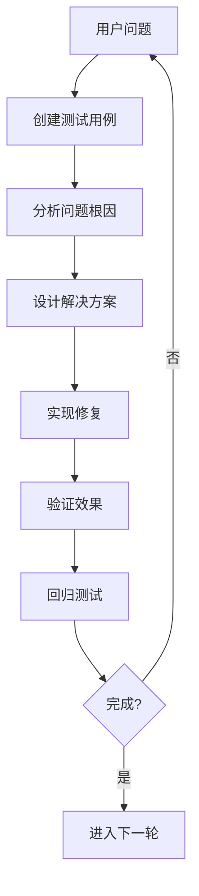

# DNA Context Protocol 测试框架文档

> **项目**: DNA Context Protocol - Mermaid格式化器测试体系  
> **版本**: v1.0  
> **创建日期**: 2025-09-03  
> **维护者**: Augment Agent

## 📚 文档概览

本测试框架包含以下核心文档：

1. **[测试方法论](./testing-methodology-for-complex-formatters.md)** - 核心测试理念和工作流程
2. **[测试用例集](./mermaid-formatter-test-cases.md)** - 完整的测试用例和工具函数
3. **[本文档]** - 框架使用指南和最佳实践

## 🎯 框架特点

### ✨ 核心优势
- **问题驱动**: 每次优化都基于具体的用户问题
- **渐进式测试**: 从简单到复杂的系统性测试方法
- **真实场景**: 使用企业级复杂用例验证功能
- **高效迭代**: 快速原型 → 问题发现 → 针对性修复
- **完整覆盖**: 语法特性、场景复杂度、用户体验全覆盖

### 🔧 技术特色
- **两轮处理机制**: 预处理合并 + 格式化输出
- **智能元素识别**: 统一的正则表达式模式库
- **模块化设计**: 功能分离，易于扩展和维护
- **性能优化**: 高效算法，适合大型文档处理

## 🚀 快速开始

### 1. 理解测试理念


### 2. 应用测试流程
```javascript
// 第一步：创建失败测试用例
const failingTest = {
  input: `/* 用户报告的问题代码 */`,
  expected: `/* 期望的格式化结果 */`,
  description: "用户问题描述"
};

// 第二步：运行测试确认问题
runTest(formatter, failingTest); // 应该失败

// 第三步：修复问题
// ... 实现修复逻辑 ...

// 第四步：验证修复
runTest(formatter, failingTest); // 应该通过

// 第五步：回归测试
runTestSuite(formatter, allTests); // 确保没有破坏其他功能
```

### 3. 创建测试用例
```javascript
// 遵循测试用例结构
const testCase = {
  name: "功能名称",
  description: "详细描述测试目标",
  input: "原始输入代码",
  expected: "期望输出结果",
  category: "测试分类", // basic, connection, subgraph, complex
  complexity: "复杂度"   // simple, medium, complex
};
```

## 📋 测试分类体系

### 1. 按功能分类
```
基础语法测试/
├── 图表类型声明
├── 节点形状定义
├── 连接符处理
└── 缩进和格式化

高级功能测试/
├── 子图和嵌套
├── 样式和类定义
├── 特殊指令处理
└── 多图表类型支持

综合场景测试/
├── 企业级复杂流程
├── 多特性组合
├── 边界情况处理
└── 性能压力测试
```

### 2. 按复杂度分类
```
简单 (Simple)
├── 单一语法特性
├── 基础功能验证
└── 正常输入处理

中等 (Medium)
├── 双特性组合
├── 常见使用场景
└── 轻微异常处理

复杂 (Complex)
├── 多特性综合
├── 企业级场景
├── 边界情况
└── 异常恢复
```

## 🔧 工具函数库

### 测试执行工具
```javascript
// 单个测试执行
runTest(formatter, testCase)

// 测试套件执行
runTestSuite(formatter, testCases)

// 性能测试
performanceTest(formatter, input, iterations)

// 差异分析
analyzeDifferences(original, formatted)
```

### 测试数据生成
```javascript
// 生成基础测试用例
generateBasicTests(syntaxFeatures)

// 生成组合测试用例
generateCombinationTests(features, complexity)

// 生成边界测试用例
generateEdgeCases(boundaries)
```

### 结果验证工具
```javascript
// 结构化比较
compareStructure(expected, actual)

// 语法验证
validateSyntax(output)

// 格式一致性检查
checkFormatConsistency(output)
```

## 📊 测试报告模板

### 功能测试报告
```
🧪 功能测试报告
==================
测试日期: 2025-09-03
测试版本: v1.2.0
测试用例: 45个

📈 测试结果:
- 通过: 42个 (93.3%)
- 失败: 3个 (6.7%)
- 异常: 0个 (0%)

🔍 失败分析:
1. 复杂嵌套子图处理 - 缩进问题
2. 特殊字符转义 - 正则表达式匹配
3. 性能优化 - 大文档处理超时

📋 改进建议:
- 优化嵌套结构的缩进算法
- 增强特殊字符处理逻辑
- 实现增量处理机制
```

### 性能测试报告
```
⚡ 性能测试报告
==================
测试环境: Node.js v18.0.0
测试数据: 1000行复杂Mermaid代码
迭代次数: 1000次

📊 性能指标:
- 平均处理时间: 2.34ms
- 吞吐量: 427 ops/sec
- 内存使用: 15.2MB
- CPU使用率: 12%

📈 性能趋势:
- 相比v1.1.0提升23%
- 内存使用减少18%
- 大文档处理稳定性提升
```

## 🎯 最佳实践

### 1. 测试驱动开发
```javascript
// 先写测试，再写实现
describe('新功能', () => {
  it('应该正确处理新语法', () => {
    const input = '/* 新语法示例 */';
    const expected = '/* 期望输出 */';
    expect(formatter(input)).toBe(expected);
  });
});
```

### 2. 持续集成
```yaml
# CI配置示例
test:
  script:
    - npm run test:unit
    - npm run test:integration
    - npm run test:performance
  coverage: 90%
```

### 3. 版本控制
```
v1.0.0 - 基础功能实现
├── 基础节点和连接处理
├── 简单缩进格式化
└── 核心测试用例

v1.1.0 - 标签和子图支持
├── 连接标签处理
├── 子图嵌套支持
└── 扩展测试覆盖

v1.2.0 - 复杂语法支持
├── 多图表类型支持
├── 特殊指令处理
└── 企业级测试用例
```

## 🔮 未来规划

### 短期目标 (1-2个月)
- [ ] 完善自动化测试框架
- [ ] 增加更多边界情况测试
- [ ] 优化性能测试工具
- [ ] 建立持续集成流水线

### 中期目标 (3-6个月)
- [ ] 扩展到其他格式化器
- [ ] 建立测试数据库
- [ ] 开发可视化测试报告
- [ ] 集成用户反馈系统

### 长期目标 (6-12个月)
- [ ] 构建通用格式化器测试平台
- [ ] 开源测试框架
- [ ] 建立社区贡献机制
- [ ] 发布最佳实践指南

## 📞 联系和贡献

### 维护团队
- **主要维护者**: Augment Agent
- **技术支持**: DNA Context Protocol Team
- **文档维护**: 开发团队

### 贡献指南
1. Fork项目仓库
2. 创建功能分支
3. 添加测试用例
4. 提交Pull Request
5. 代码审查和合并

### 问题反馈
- **Bug报告**: 使用GitHub Issues
- **功能请求**: 通过Discussion讨论
- **文档改进**: 直接提交PR

---

*这套测试框架经过实战验证，已成功应用于Mermaid格式化器的开发。希望能为未来的项目开发提供有价值的参考和指导。*
