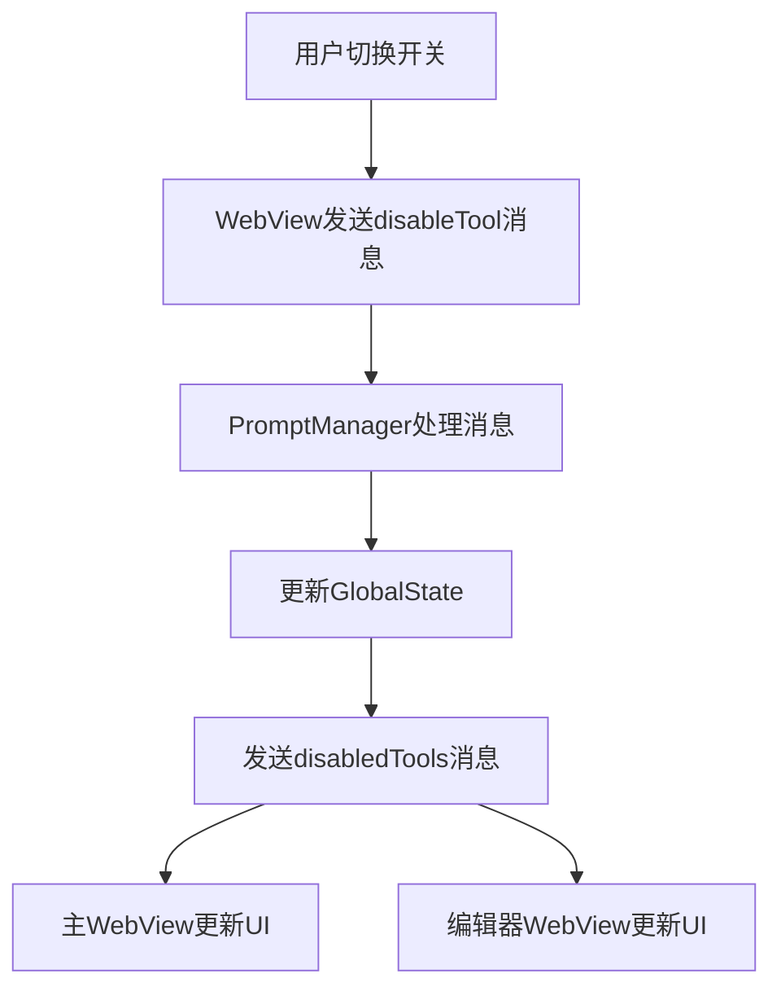

# 🛠️ Tools标签实现原理报告

## 📋 项目概述

本报告详细记录了将工具开关功能从Prompt Template Editor重构到Settings页面Tools标签的完整实现过程，展示了一个复杂的VSCode扩展架构中状态管理和消息通信的精妙设计。

## 🎯 重构目标

### 原始状态
- 工具开关位于Prompt Template Editor中
- 用户需要打开编辑器才能管理工具
- 界面组织不够直观

### 目标状态
- 工具开关移至Settings → Tools标签
- 新增Customize Instructions快捷入口
- 更清晰的功能分组和用户体验

## 🏗️ 架构分析

### 扩展架构概览
```
VSCode Extension
├── Frontend (React WebView)
│   ├── Main WebView (Settings页面)
│   └── Prompt Editor WebView (独立窗口)
├── Backend (Node.js)
│   ├── WebviewManager (主界面消息处理)
│   ├── PromptManager (编辑器消息处理)
│   └── GlobalStateManager (状态持久化)
└── Message System (双向通信)
```

### 状态管理流程


## 🔧 核心实现

### 1. 前端组件重构

#### 新建Tools标签组件
**文件**: `webview-ui-vite/src/components/settings-view/preferences/tools-tab.tsx`

```typescript
// 工具数据和原子状态管理
export const tools = toolPrompts.reduce((acc, tool) => {
    acc[tool.name] = tool
    return acc
}, {} as Record<ToolName, ToolPromptSchema>)

export const disabledToolsAtom = atom(new Set<ToolName>())
export const currentPromptContentAtom = atom("")
export const isCurrentPreviewAtom = atom(false)

// 工具开关组件
const ToolCards = () => {
    const [disabledTools, setDisabledTools] = useAtom(disabledToolsAtom)
    
    // 监听扩展消息
    useEvent("message", (event) => {
        const message = event.data as ExtensionMessage
        if (message.type === "disabledTools") {
            setDisabledTools(new Set(message.tools))
        }
    })
    
    // 渲染工具卡片和开关
    return (
        <ScrollArea className="h-[400px] w-full rounded-md border">
            {Object.entries(tools).map(([name, schema]) => (
                <Card key={name}>
                    <Switch
                        checked={!disabledTools.has(name as ToolName)}
                        onCheckedChange={(e) =>
                            vscode.postMessage({
                                type: "disableTool",
                                toolName: name as ToolName,
                                boolean: e,
                                content: isCurrentPreview ? currentPromptContent : "",
                            })
                        }
                    />
                </Card>
            ))}
        </ScrollArea>
    )
}
```

#### 标签配置更新
**文件**: `webview-ui-vite/src/components/settings-view/preferences/atoms.ts`

```typescript
export const tabItems = [
    { value: "preferences", label: "Preferences" },
    { value: "advanced", label: "Advanced" },
    { value: "tools", label: "Tools" },        // 新增
    { value: "agents", label: "Agents" },
] as const
```

### 2. 后端消息处理增强

#### 关键问题发现
原始实现中，`disabledTools`消息只发送给Prompt Editor WebView，导致主WebView无法接收状态更新。

#### 解决方案1: 启动时状态同步
**文件**: `src/providers/webview/webview-manager.ts`

```typescript
case "webviewDidLaunch":
    await this.postBaseStateToWebview()
    // 🔥 关键修复：向主webview发送禁用工具列表
    const disabledTools = GlobalStateManager.getInstance().getGlobalState("disabledTools") ?? []
    await this.postMessageToWebview({
        type: "disabledTools",
        tools: disabledTools,
    })
    break
```

#### 解决方案2: 状态变更时双向通知
**文件**: `src/providers/webview/prompt-manager.ts`

```typescript
case "disableTool":
    // 更新全局状态
    await GlobalStateManager.getInstance().updateGlobalState("disabledTools", Array.from(newDisabledTools))
    
    const promises: Promise<any>[] = []
    // 发送给Prompt Editor webview
    promises.push(this.postMessageToWebview({
        type: "disabledTools",
        tools: Array.from(newDisabledTools),
    }))
    // 🔥 关键修复：同时发送给主webview
    promises.push(this.webviewManager.postMessageToWebview({
        type: "disabledTools",
        tools: Array.from(newDisabledTools),
    }))
    
    await Promise.all(promises)
    break
```

## 🎨 用户界面优化

### 新的标签布局
```
Settings
├── Preferences (模型选择、提供商管理)
├── Advanced (高级功能开关、配置)
├── Tools (自定义指令 + 工具开关) ← 新增
└── Agents (代理配置)
```

### Tools标签内容组织
1. **Customize Instructions** (从Advanced移动过来)
   - Open Editor按钮
   - 功能说明文字
2. **Available Tools** (工具开关网格)
   - 工具卡片展示
   - 实时开关控制
   - 工具描述信息

## 🔄 消息通信协议

### 前端 → 后端
```typescript
// 切换工具状态
{
    type: "disableTool",
    toolName: ToolName,
    boolean: boolean,
    content?: string
}
```

### 后端 → 前端
```typescript
// 同步禁用工具列表
{
    type: "disabledTools",
    tools: ToolName[]
}
```

## 🧪 测试验证

### 功能测试清单
- [x] 工具开关在Tools标签中正常显示
- [x] 开关状态与后端状态同步
- [x] 多个WebView之间状态一致
- [x] 页面刷新后状态保持
- [x] Customize Instructions功能正常
- [x] 原Prompt Editor功能不受影响

### 构建验证
```bash
# WebView构建
cd webview-ui-vite && npm run build
✓ 5056 modules transformed

# 扩展打包
pnpm run build
✓ VSIX package created: automatic-iterator-2.3.13.vsix
```

## 🎉 实现亮点

### 1. 架构设计精妙
- 双WebView架构下的状态同步
- 原子状态管理确保数据一致性
- 消息驱动的松耦合设计

### 2. 问题诊断准确
- 快速定位到消息分发不完整的根本原因
- 通过代码分析而非猜测解决问题
- 保持了原有功能的完整性

### 3. 用户体验优化
- 更直观的功能分组
- 一站式工具管理界面
- 保持了所有原有功能

## 🚀 技术价值

这个重构展示了：
1. **复杂状态管理**：多WebView环境下的状态同步
2. **消息系统设计**：扩展与WebView的双向通信
3. **架构重构能力**：在不破坏现有功能的前提下优化用户体验
4. **问题解决思路**：从现象到本质的系统性分析

---

**结论**: 这是一个展示现代VSCode扩展开发最佳实践的优秀案例，完美平衡了技术复杂性和用户体验！🎯
