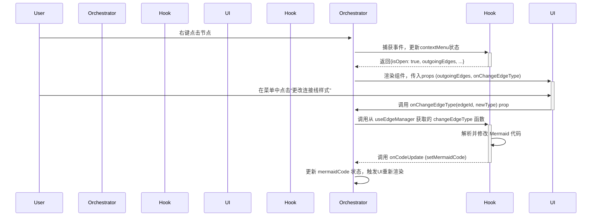

# 右键菜单深度技术报告

## 1. 概述

本文档对 Mermaid 编辑器中的右键菜单功能进行深入的技术剖析。右键菜单是用户与图表交互的核心，其实现涉及状态管理、UI渲染和核心的Mermaid代码解析与操作。本文将详细阐述其架构、数据流和关键函数的实现细节。

## 2. 架构与数据流

右键菜单的功能由三个核心文件协同完成，形成了一个清晰的单向数据流：

-   **`book-panel.tsx` (业务编排层)**: 作为父组件，负责初始化所有相关的Hooks，管理核心状态（如 `mermaidCode`），并将状态和操作函数（回调）传递给UI组件。
-   **`use-edge-manager.ts` (核心逻辑层)**: 一个自定义Hook，封装了所有与连接线相关的复杂逻辑，包括解析、索引和修改Mermaid代码。它不直接与UI交互，仅提供数据和方法。
-   **`NodeContextMenu.tsx` (UI表现层)**: 一个纯UI组件，负责根据传入的props渲染菜单界面，并通过回调函数将用户的操作意图传递回业务编排层。

### 数据流示意图

## 3. 核心逻辑层: `use-edge-manager.ts`

这是整个右键菜单功能的引擎，负责对Mermaid代码进行底层的解析和操作。

### 3.1. 关键函数: `parseAndIndexEdges`

此函数在 `mermaidCode` 发生变化时通过 `useEffect` 自动执行，其核心任务是解析代码并为每个连接线建立一个可供快速查找的索引。

**实现细节:**

1.  **正则表达式定义**: 函数的核心是两个动态构建的正则表达式，用于识别带标签和不带标签的连接线。
    -   `nodePattern`: `\w+(?:\[[^\]]*\]|\{[^}]*\}|\([^)]*\))?`
        -   这个模式是整个解析逻辑的关键。`\w+` 匹配基础的节点ID（如 `A`），而 `(?:...)?` 是一个非捕获组，用于匹配可选的节点形状和文本（如 `[开始]` 或 `{判断}`）。这使得我们能够支持 `A[开始] --> B{判断}` 这样的复杂语法。
    -   `labeledRegex` 和 `normalRegex`: 基于 `nodePattern` 构建，分别用于匹配 `A -->|标签| B` 和 `A --> B` 两种格式。

2.  **代码遍历与解析**:
    -   函数逐行读取 `mermaidCode`。
    -   对每一行，依次尝试用 `labeledRegex` 和 `normalRegex` 进行匹配。

3.  **节点ID提取与索引**: 
    -   匹配成功后，会得到完整的节点定义（如 `A[开始]`）。
    -   随后，通过 `sourceDef.match(/\w+/)` 再次匹配，从中提取出纯粹的节点ID（如 `A`）。
    -   **索引创建**: 函数会创建一个名为 `edgeMap` 的 `Map` 对象。它以一个唯一的ID（如 `A-B-0`，最后的数字用于区分同源同目标的多条连接线）为键，值为一个包含该连接线行号 (`lineNumber`) 和原始文本 (`rawLine`) 的对象。这个 `edgeMap` 是后续所有修改和删除操作的基础。

### 3.2. 关键函数: `changeEdgeType`

当用户在UI上选择一个新的连接线样式时，此函数被调用以执行实际的代码修改。

**实现细节:**

1.  **定位**: 函数接收 `edgeId` 和 `newType` 作为参数。它首先使用 `edgeMap` 快速定位到目标连接线所在的 `lineNumber`。
2.  **重新解析**: 它会取出目标行 `currentLine`，并使用与 `parseAndIndexEdges` 中完全相同的正则表达式逻辑，再次解析出源节点和目标节点的完整定义（`sourceDef` 和 `targetDef`）。
3.  **构建新代码行**: 它通过字符串模板将 `sourceDef`、`newType` 和 `targetDef` 拼接成一个新的代码行 `newLine`。
4.  **代码替换**: 它将整个 `mermaidCode` 分割成一个行数组，用 `newLine` 替换掉 `lineNumber` 处的旧行，然后重新组合成完整的代码字符串。
5.  **状态更新**: 最后，调用 `onCodeUpdate` 回调函数（即 `book-panel.tsx` 中的 `setMermaidCode`），将更新后的代码写回状态，从而触发React的重新渲染。

## 4. UI表现层: `NodeContextMenu.tsx`

这是一个纯粹的UI组件，它的职责是展示数据和响应用户操作。

### 4.1. 状态管理

-   `selectedEdgeId`: 这是组件内部的一个关键 `useState`。当用户在菜单的连接线列表中点击某一项时，`handleSelectEdge` 函数会更新这个state。这个state的变化会触发UI的条件渲染，动态地显示或隐藏“更改连接线样式”的按钮组。

### 4.2. 渲染逻辑

-   **模式切换**: 组件的渲染内容由 `isEditMode` 和 `isEdgeEditMode` 两个prop决定，分别对应节点操作菜单和连接线操作菜单。
-   **数据驱动**: 在连接线编辑模式下，组件通过 `.map()` 方法遍历从props接收的 `outgoingEdges` 数组，动态生成连接线列表。
-   **样式按钮**: “更改连接线样式”的按钮组同样是通过遍历从 `use-edge-manager.ts` 导入的 `EDGE_TYPES` 常量数组来动态生成的。

### 4.3. 事件处理

-   组件内的所有操作函数（如 `handleChangeEdgeType`, `handleDeleteEdge`）本身不包含复杂逻辑。它们唯一的任务就是调用从props接收的回调函数（如 `props.onChangeEdgeType(...)`），将事件和相关数据（如 `edgeId`, `newType`）传递回父组件 `book-panel.tsx` 进行处理。

## 5. 总结

右键菜单的实现是一个典型的分层架构范例。通过将核心的文本解析与操作逻辑封装在自定义Hook `use-edge-manager.ts` 中，我们将复杂性与UI完全解耦。UI组件 `NodeContextMenu.tsx` 只负责展示和事件转发，而 `book-panel.tsx` 则作为“胶水层”，清晰地连接了逻辑层和表现层。这种设计使得代码易于维护、测试和扩展。
