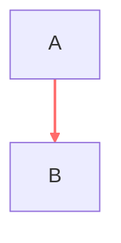

# ~~~ 不可见连接线修复

## 问题描述
`~~~` 按钮无法隐藏带颜色的连接线。原因是如果连接线有对应的 `linkStyle` 颜色样式，即使连接线类型是 `~~~`，Mermaid 仍然会显示这条连接线。

## 问题根源


当我们将 `A --> B` 改为 `A ~~~ B` 时：
```mermaid
graph TD
    A ~~~ B
    linkStyle 0 stroke:#ff6b6b,stroke-width:2px  # 这行导致连接线仍然可见！
```

## 解决方案

### 1. 在 changeEdgeType 函数中添加特殊处理
当连接线类型改为 `~~~` 时：
1. 正常更新连接线语法
2. **额外步骤**：查找并删除对应的 `linkStyle` 语句

```javascript
// Special handling for ~~~ (invisible connection)
if (newType === "~~~") {
  // Calculate the edge index
  let edgeIndex = 0;
  // ... 计算逻辑 ...
  
  // Remove corresponding linkStyle if exists
  const linkStyleRegex = new RegExp(`^\\s*linkStyle ${edgeIndex} `);
  for (let i = lines.length - 1; i >= 0; i--) {
    if (linkStyleRegex.test(lines[i])) {
      lines.splice(i, 1);  // 删除 linkStyle 行
      break;
    }
  }
}
```

### 2. 在 applyEdgeColor 函数中添加保护
防止给 `~~~` 连接线应用颜色：

```javascript
// Check if the edge is invisible (~~~)
const currentLine = lines[edgeToColor.lineNumber];
if (currentLine && currentLine.includes("~~~")) {
  onStatusMessage(`❌ Cannot apply color to invisible connection (~~~): ${edgeId}`);
  return;
}
```

## 修复效果

### 修复前

点击 `~~~` 按钮后：
```mermaid
graph TD
    A ~~~ B
    linkStyle 0 stroke:#ff6b6b,stroke-width:2px  # 连接线仍然可见（红色）
```

### 修复后

点击 `~~~` 按钮后：
```mermaid
graph TD
    A ~~~ B
    # linkStyle 被自动删除，连接线真正不可见
```

## 用户体验改进

### 1. 智能清理
- 应用 `~~~` 时自动删除颜色样式
- 状态消息提示："(color removed for invisibility)"

### 2. 防护机制
- 尝试给 `~~~` 连接线应用颜色时会被阻止
- 错误消息："Cannot apply color to invisible connection"

### 3. 一致性保证
- `~~~` 连接线始终保持不可见
- 不会因为残留的 `linkStyle` 而意外显示

## 测试场景

### 场景1：有颜色的连接线转为不可见
1. 创建连接线：`A --> B`
2. 应用红色：生成 `linkStyle 0 stroke:#ff6b6b,stroke-width:2px`
3. 点击 `~~~` 按钮
4. **预期结果**：连接线变为 `A ~~~ B`，`linkStyle` 被删除，连接线完全不可见

### 场景2：尝试给不可见连接线应用颜色
1. 创建不可见连接线：`A ~~~ B`
2. 尝试应用颜色
3. **预期结果**：操作被阻止，显示错误消息

### 场景3：多条连接线的索引处理
1. 创建多条连接线：`A --> B`, `B --> C`, `C --> D`
2. 给第2条应用颜色：`linkStyle 1 stroke:#45b7d1,stroke-width:2px`
3. 将第2条改为 `~~~`
4. **预期结果**：只删除 `linkStyle 1`，其他 `linkStyle` 保持不变

## 技术细节

### 索引计算
使用与 `applyEdgeColor` 相同的索引计算逻辑，确保删除正确的 `linkStyle`。

### 向后删除
使用 `for (let i = lines.length - 1; i >= 0; i--)` 向后遍历，避免删除行后索引变化的问题。

### 正则匹配
使用精确的正则表达式 `^\\s*linkStyle ${edgeIndex} ` 确保只删除对应索引的 `linkStyle`。

这样修复后，`~~~` 按钮就能真正隐藏任何连接线，无论它之前是否有颜色样式！
