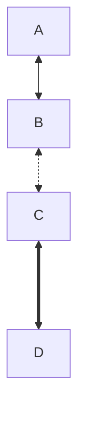
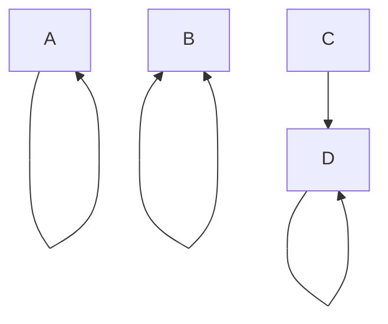
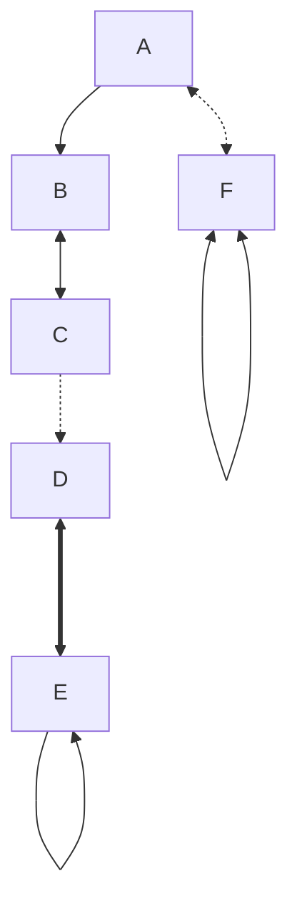

# 双箭头支持和自连接功能测试

## 新增功能

### 1. 双箭头支持
在 "Change Connection Style" 菜单中添加了以下双箭头选项：
- `<-->` - Double Arrow (双向箭头)
- `<-.->` - Dashed Double Arrow (虚线双向箭头)  
- `<===>` - Thick Double Arrow (粗线双向箭头)

### 2. 自连接功能
在 "Change Connection Style" 菜单中添加了以下自连接选项：
- `SELF_LOOP` - Self Loop (自连接循环)
- `SELF_DOUBLE` - Self Double (双向自连接)

## 测试用例

### 基础双箭头测试

### 自连接测试

### 混合测试

## 预期行为

### 右键菜单功能
1. 在edge edit模式下，右键点击节点应显示上下文菜单
2. 选择连接线后，应显示"Change Connection Style"选项
3. 样式选项应包括新添加的双箭头和自连接选项

### 连接线样式更改
1. 选择双箭头样式应正确更新Mermaid代码
2. 选择自连接样式应将目标节点设置为源节点
3. 所有现有功能应保持不变

### 拖拽创建连接
1. 拖拽到同一节点应创建自连接
2. 拖拽到不同节点应创建普通连接
3. 状态消息应正确显示连接结果

## 实现细节

### 代码更改位置
1. `use-edge-manager.ts` - 添加新的EDGE_TYPES
2. `use-edge-manager.ts` - 更新正则表达式支持双箭头
3. `use-edge-manager.ts` - 更新changeEdgeType函数处理自连接
4. `use-edge-editor.ts` - 更新handleMouseUp支持自连接
5. `use-edge-editor.ts` - 更新正则表达式支持双箭头解析

### 关键功能
- 双箭头语法: `A <--> B`, `A <-.-> B`, `A <===> B`
- 自连接语法: `A --> A`, `A <--> A`
- 特殊处理: SELF_LOOP 和 SELF_DOUBLE 转换为实际的自连接语法
