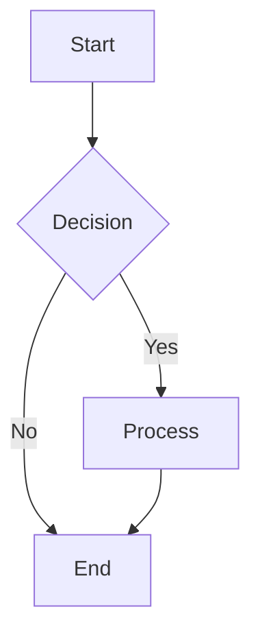
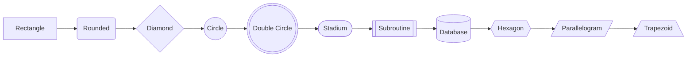
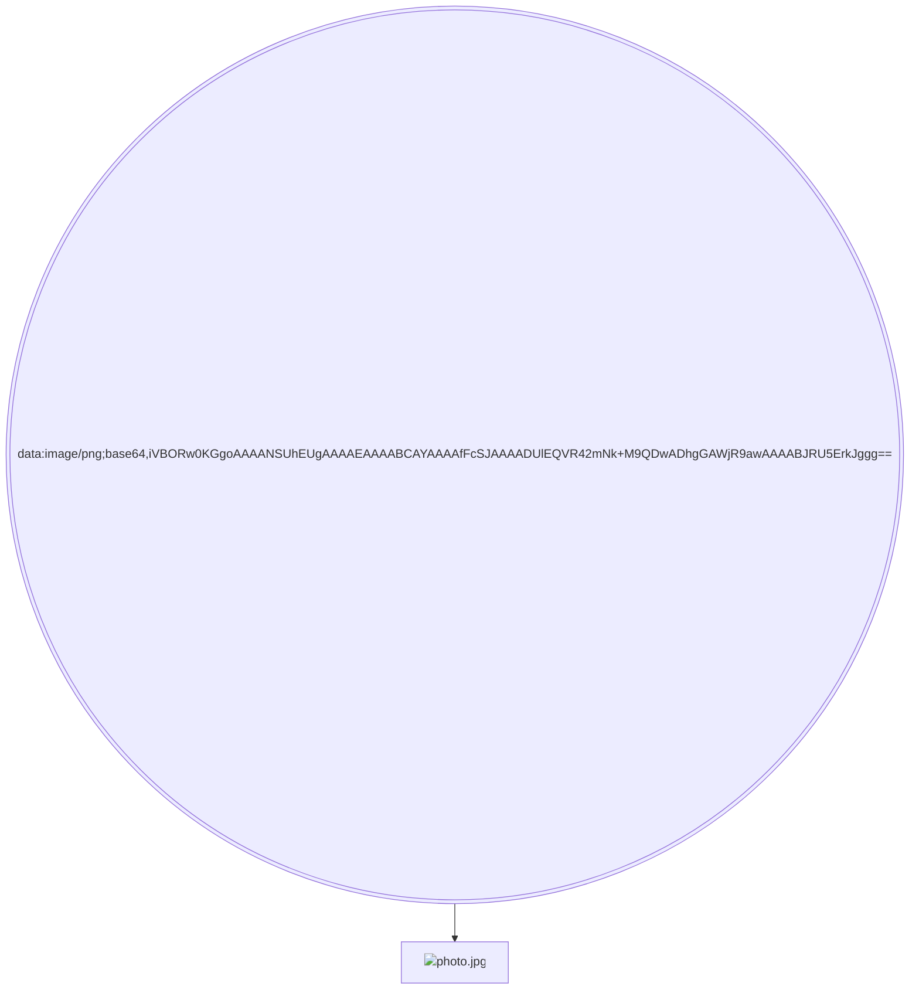

# Monaco Editor 升级测试

## 🎯 **升级完成**

### ✅ **从简单textarea升级到专业Monaco Editor**

**之前**：
```tsx
<textarea
  value={mermaidCode}
  onChange={(e) => setMermaidCode(e.target.value)}
  className="flex-1 p-4 bg-transparent border-none outline-none resize-none font-mono text-sm h-full min-h-0"
  placeholder="Enter Mermaid code here..."
  spellCheck={false}
/>
```

**现在**：
```tsx
<MermaidMonacoEditor
  value={mermaidCode}
  onChange={setMermaidCode}
  className="flex-1"
  placeholder="Enter Mermaid code here..."
/>
```

## 🚀 **Monaco Editor 功能特性**

### 1. **专业的Mermaid语法高亮**
- **关键字高亮**：`graph`, `flowchart`, `TD`, `LR` 等
- **连接符高亮**：`-->`, `---`, `==>`, `-.->` 等
- **节点形状识别**：
  - 矩形：`A[Text]` - 青色
  - 圆角：`A(Text)` - 蓝色
  - 菱形：`A{Text}` - 黄色
  - 圆形：`A((Text))` - 红色
  - 双圆形：`A(((Text)))` - 粉色
  - 体育场：`A([Text])` - 绿色
  - 子程序：`A[[Text]]` - 黄色
  - 圆柱形：`A[(Text)]` - 蓝色
  - 六边形：`A{{Text}}` - 橙色
  - 平行四边形：`A[/Text/]` - 紫色
  - 梯形：`A[/Text\]` - 粉色

### 2. **智能编辑功能**
- **自动补全**：输入时提供智能建议
- **括号匹配**：自动高亮匹配的括号
- **代码折叠**：支持折叠长代码块
- **多光标编辑**：Ctrl+Click 添加多个光标
- **查找替换**：Ctrl+F 查找，Ctrl+H 替换
- **格式化**：自动缩进和格式化

### 3. **Base64图片处理**
- **特殊高亮**：Base64数据显示为灰色斜体
- **折叠按钮**：检测到Base64数据时显示折叠选项
- **智能识别**：自动识别图片数据并提供优化显示

### 4. **主题适配**
- **自动主题切换**：跟随VSCode主题
- **深色主题**：`mermaid-dark` - 针对Mermaid优化的深色主题
- **浅色主题**：`mermaid-light` - 针对Mermaid优化的浅色主题
- **VSCode集成**：使用VSCode的颜色变量

## 🎨 **语法高亮示例**

### 基本流程图


### 多种节点形状


### 带图片的节点


## ⌨️ **快捷键支持**

### 编辑快捷键
- **Ctrl+Z** / **Ctrl+Y**：撤销/重做
- **Ctrl+A**：全选
- **Ctrl+C** / **Ctrl+V**：复制/粘贴
- **Ctrl+X**：剪切
- **Ctrl+F**：查找
- **Ctrl+H**：查找替换
- **Ctrl+G**：跳转到行
- **Ctrl+/**：切换注释

### 选择快捷键
- **Ctrl+L**：选择当前行
- **Ctrl+D**：选择下一个相同单词
- **Ctrl+Shift+L**：选择所有相同单词
- **Alt+Click**：添加光标
- **Ctrl+Alt+↑/↓**：添加上/下光标

### 代码操作
- **Tab** / **Shift+Tab**：增加/减少缩进
- **Alt+↑/↓**：移动行
- **Shift+Alt+↑/↓**：复制行
- **Ctrl+Shift+K**：删除行
- **Ctrl+Enter**：在下方插入行
- **Ctrl+Shift+Enter**：在上方插入行

## 🔧 **技术实现**

### 语言注册
```typescript
monaco.languages.register({ id: 'mermaid' });
```

### 语法定义
```typescript
monaco.languages.setMonarchTokensProvider('mermaid', {
  tokenizer: {
    root: [
      [/\b(graph|flowchart|sequenceDiagram)\b/, 'keyword'],
      [/-->|---|-\.-|==>/, 'operator.connection'],
      [/\w+\[.*?\]/, 'entity.name.function.rectangle'],
      // ... 更多规则
    ]
  }
});
```

### 自定义主题
```typescript
monaco.editor.defineTheme('mermaid-dark', {
  base: 'vs-dark',
  inherit: true,
  rules: [
    { token: 'keyword', foreground: '569cd6', fontStyle: 'bold' },
    { token: 'entity.name.function.rectangle', foreground: '4ec9b0' },
    // ... 更多样式规则
  ]
});
```

## ✅ **测试用例**

### 测试1：基本语法高亮
- 关键字应该显示为蓝色粗体
- 连接符应该显示为白色粗体
- 节点应该根据形状显示不同颜色

### 测试2：编辑功能
- 输入时应该有语法提示
- 括号应该自动匹配
- 支持多光标编辑

### 测试3：主题切换
- 切换VSCode主题时编辑器主题应该同步更新
- 深色/浅色主题应该正确应用

### 测试4：Base64处理
- 检测到Base64数据时应该显示折叠按钮
- Base64数据应该显示为灰色斜体

## 🎉 **升级优势**

### 用户体验提升
- ✅ 专业的代码编辑体验
- ✅ 语法高亮提高可读性
- ✅ 智能提示提高编写效率
- ✅ 丰富的快捷键支持
- ✅ 代码折叠和格式化

### 开发者友好
- ✅ 基于成熟的Monaco Editor
- ✅ 完整的TypeScript支持
- ✅ 可扩展的语法定义
- ✅ 自定义主题支持
- ✅ 与VSCode完美集成

现在DNA Context Protocol拥有了专业级的代码编辑器！🚀
