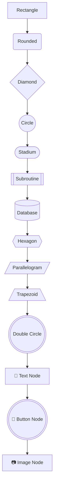
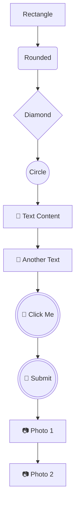

# 新增节点类型测试

## 测试用的Mermaid代码

## 新增的节点类型

1. **Stadium** - `([Text])` - 体育场形状/胶囊形
2. **Subroutine** - `[[Text]]` - 子程序形状
3. **Cylindrical** - `[(Text)]` - 圆柱形/数据库
4. **Hexagon** - `{{Text}}` - 六边形
5. **Parallelogram** - `[/Text/]` - 平行四边形
6. **Trapezoid** - `[/Text\]` - 梯形
7. **Double Circle** - `(((Text)))` - 双圆形

## 特殊节点类型更改

✅ **Button节点形状改为Double Circle**
- 原来：`Button1("🔘 Button Node")` (圆角矩形)
- 现在：`Button1(((🔘 Button Node)))` (双圆形)

✅ **专用ID前缀**
- **Button节点**：`Button1`, `Button2`, `Button3`...
- **Image节点**：`Image1`, `Image2`, `Image3`...
- **Text节点**：`Text1`, `Text2`, `Text3`...
- **其他节点**：`node1`, `node2`, `node3`... (保持不变)

## 功能验证清单

- [ ] 工具栏显示所有新节点类型
- [ ] 右键菜单显示所有节点类型选项
- [ ] 可以创建新的节点类型
- [ ] 可以更改现有节点的类型
- [ ] 节点解析正确识别新类型
- [ ] 生成的Mermaid语法正确
- [ ] Button节点使用双圆形形状
- [ ] Button节点ID使用"Button"前缀
- [ ] Image节点ID使用"Image"前缀
- [ ] Text节点ID使用"Text"前缀

## ID命名规则示例

## Button和Image节点更新

### ✅ **Button节点创建更新**
- **之前**：点击Button按钮 → 输入标签和描述 → 创建文本节点
- **现在**：点击Button按钮 → 打开图片选择器 → 选择图片 → 创建图片节点

### ✅ **统一的图片节点类型**
- Button节点和Image节点现在都是图片类型
- 都使用相同的图片显示格式：`""`
- Button节点使用双圆形形状 `(((content)))`，Image节点使用矩形形状 `[content]`

### ✅ **右键菜单特殊功能**
对于Button和Image节点，右键菜单会显示额外的"Image Actions"区域：
- **Add Image按钮**：重新选择图片替换当前图片
- **Remove Image按钮**：移除图片，恢复为默认文本

## 使用说明

### 基本操作
1. 在节点编辑模式下，右键点击任意节点
2. 在"Node Type"部分可以看到所有14种节点类型
3. 点击任意类型按钮即可更改节点形状
4. 在工具栏中也可以看到新增的节点类型按钮
5. 新创建的节点会自动使用对应的ID前缀

### 图片节点操作
1. **创建Button节点**：点击工具栏Button按钮 → 选择图片文件 → 自动创建
2. **创建Image节点**：点击工具栏Image按钮 → 选择图片文件 → 自动创建
3. **更换图片**：右键Button/Image节点 → 点击"Add Image" → 选择新图片
4. **移除图片**：右键Button/Image节点 → 点击"Remove Image" → 恢复默认文本
