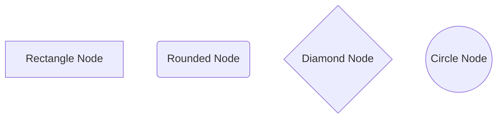
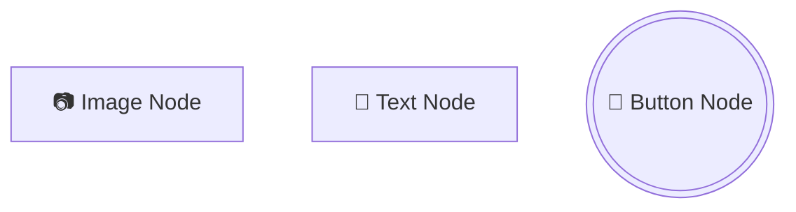

# 节点编辑功能修复测试

## 修复内容

### 1. getNodeDetails 函数修复
- **问题**: 正则表达式不完整，缺少对复杂节点类型的支持
- **修复**: 扩展正则表达式支持所有节点类型：
  - Rectangle: `[text]`
  - Rounded: `(text)`
  - Diamond: `{text}`
  - Circle: `((text))`
  - Stadium: `([text])`
  - Subroutine: `[[text]]`
  - Cylindrical: `[(text)]`
  - Hexagon: `{{text}}`
  - Parallelogram: `[/text/]`
  - Trapezoid: `[/text\]`
  - Double Circle: `(((text)))`
  - Label: `>text>`

### 2. editNodeText 函数修复
- **问题**: 只支持4种基本节点类型的文本编辑
- **修复**: 扩展支持所有节点类型的文本编辑，包括：
  - 所有基本形状
  - 所有复杂形状
  - 添加通用回退机制处理未匹配的情况

## 测试用例

### 基本节点类型


### 复杂节点类型
```mermaid
flowchart TD
    E([Stadium Node])
    F[[Subroutine Node]]
    G[(Cylindrical Node)]
    H{{Hexagon Node}}
    I[/Parallelogram Node/]
    J[/Trapezoid Node\]
    K(((Double Circle Node)))
    L>Label Node>
```

### 特殊节点类型


## 预期行为

1. **右键菜单显示**: 所有节点类型都应该能正确显示右键菜单
2. **文本框预填充**: Text字段应该正确显示当前节点的文本内容
3. **文本更新**: 点击Update按钮或按Enter键应该能正确更新节点文本
4. **图标保持**: 特殊节点（Image、Text、Button）的图标前缀应该保持不变

## 修复验证

### getNodeDetails 函数验证
- ✅ 支持所有14种节点类型的文本提取
- ✅ 正确处理带引号和不带引号的文本
- ✅ 正确移除图标前缀（📷、📝、🔘）

### editNodeText 函数验证
- ✅ 支持所有14种节点类型的文本编辑
- ✅ 保持原有节点形状不变
- ✅ 提供通用回退机制
- ✅ 正确的错误处理和状态消息

## 使用说明

1. 进入节点编辑模式
2. 右键点击任意类型的节点
3. 在弹出的右键菜单中找到"Text:"文本框
4. 文本框应该预填充当前节点的文本内容
5. 修改文本内容
6. 点击"Update"按钮或按Enter键
7. 节点文本应该成功更新，形状保持不变
