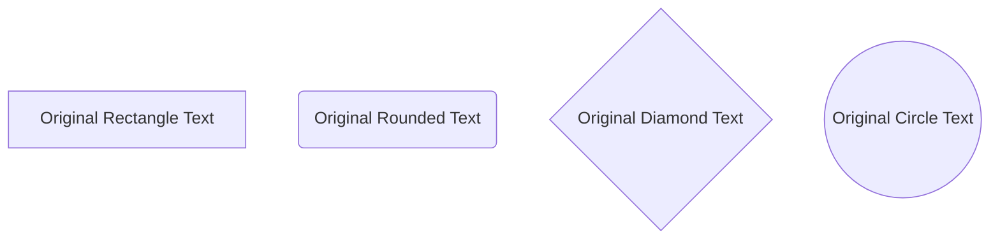
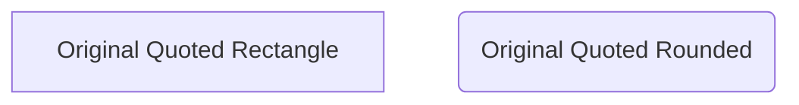
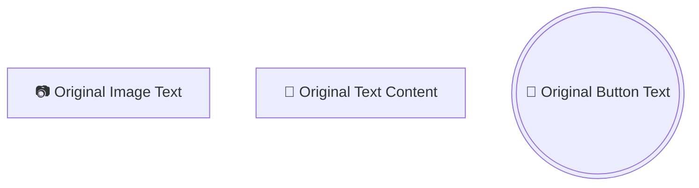

# 节点文本编辑修复测试

## 修复的问题

### 1. Text文本框输入新名字无法更新到Code Editor中
**原因**: `editNodeText` 函数中的正则表达式替换逻辑不正确
**修复**: 重写了整个替换逻辑，为每种节点类型提供精确的正则表达式模式

### 2. Text包含结构体的问题
**原因**: 文本提取时包含了结构体符号
**修复**: 正则表达式现在正确提取纯文本内容，不包含结构符号

## 测试用例

### 基本节点类型测试


**预期行为**:
- 右键点击节点A，Text字段显示: `Original Rectangle Text`
- 修改为 `New Rectangle Text`，代码应更新为: `A[New Rectangle Text]`

### 复杂节点类型测试
```mermaid
flowchart TD
    E([Original Stadium Text])
    F[[Original Subroutine Text]]
    G[(Original Database Text)]
    H{{Original Hexagon Text}}
    I[/Original Parallelogram Text/]
    J[/Original Trapezoid Text\]
    K(((Original Double Circle Text)))
    L>Original Label Text>
```

**预期行为**:
- 右键点击节点K，Text字段显示: `Original Double Circle Text` (不是 `((Original Double Circle Text`)
- 修改为 `New Double Circle Text`，代码应更新为: `K(((New Double Circle Text)))`

### 带引号的节点测试


**预期行为**:
- 右键点击节点M，Text字段显示: `Original Quoted Rectangle`
- 修改为 `New Quoted Rectangle`，代码应更新为: `M["New Quoted Rectangle"]`

### 特殊节点测试


**预期行为**:
- 右键点击Button1，Text字段显示: `Original Button Text` (图标被正确移除)
- 修改为 `New Button Text`，代码应更新为: `Button1(((🔘 New Button Text)))`

## 修复验证

### editNodeText 函数改进
✅ **精确的正则表达式匹配**: 每种节点类型都有专门的正则表达式
✅ **正确的替换逻辑**: 使用 `$1` 和 `$2` 捕获组进行精确替换
✅ **保持节点结构**: 只替换文本内容，保持所有结构符号不变
✅ **调试支持**: 添加了控制台警告，便于调试未匹配的情况

### 关键改进点
1. **分离的模式匹配**: 每种节点类型都有独立的正则表达式
2. **正确的捕获组**: 使用 `(\\s*${nodeId}\\s*)` 捕获节点ID和空格
3. **精确的文本替换**: 只替换文本部分，保持所有结构符号
4. **带引号文本支持**: 特别处理带引号的节点文本

## 测试步骤

1. 打开包含各种节点类型的Mermaid图表
2. 进入节点编辑模式
3. 右键点击任意节点
4. 检查Text字段是否正确显示纯文本内容（无结构符号）
5. 修改文本内容
6. 点击Update按钮或按Enter键
7. 验证Code Editor中的代码是否正确更新
8. 验证节点形状和结构符号是否保持不变

## 预期结果

- ✅ 所有节点类型的文本都能正确提取和显示
- ✅ 文本修改能正确更新到Code Editor中
- ✅ 节点结构和形状保持不变
- ✅ 特殊字符和图标得到正确处理
- ✅ 带引号的文本得到正确处理
