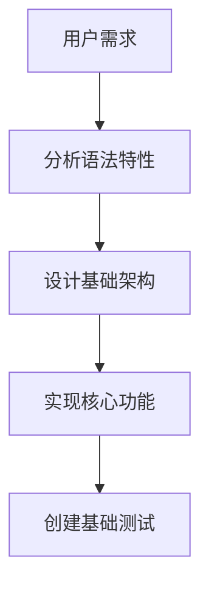
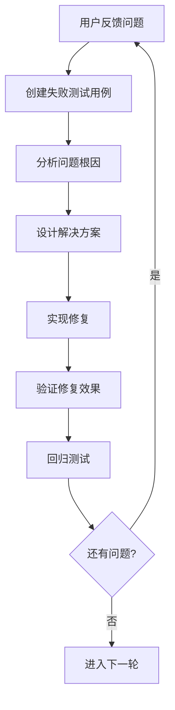
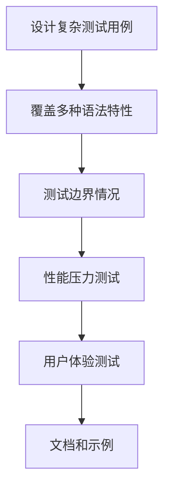

# 复杂格式化器的测试方法论

> **作者**: Augment Agent  
> **日期**: 2025-09-03  
> **项目**: DNA Context Protocol - Mermaid格式化器  
> **目标**: 记录高效的测试流程和工作思想，用于复杂代码格式化器的开发和优化

## 📋 概述

本文档记录了在开发Mermaid智能格式化器过程中总结的测试方法论。这套方法论通过渐进式测试、问题驱动优化和复杂场景覆盖，实现了高效的格式化器开发流程。

## 🎯 核心测试理念

### 1. 问题驱动的迭代开发
- **从实际问题出发**：每次优化都基于具体的格式化失败案例
- **小步快跑**：每次只解决一个核心问题，避免过度设计
- **立即验证**：每次修改后立即创建测试用例验证效果

### 2. 渐进式复杂度测试
- **简单到复杂**：从基础语法开始，逐步增加复杂度
- **单一变量**：每次测试只改变一个语法特性
- **累积验证**：确保新功能不破坏已有功能

### 3. 真实场景模拟
- **用户视角**：站在用户角度思考实际使用场景
- **边界情况**：重点测试语法边界和异常情况
- **综合应用**：创建包含多种特性的复杂测试用例

## 🔄 测试工作流程

### 阶段1: 需求分析和基础实现


**关键活动**：
- 分析目标语言的语法规则
- 设计可扩展的处理架构
- 实现最小可用版本
- 创建基础功能测试

### 阶段2: 问题发现和迭代优化


**关键活动**：
- 快速复现用户报告的问题
- 创建最小化的失败测试用例
- 分析问题的技术根因
- 设计针对性的解决方案
- 实现并验证修复效果

### 阶段3: 复杂场景测试和优化


**关键活动**：
- 创建企业级复杂测试用例
- 测试各种语法特性的组合
- 验证性能和稳定性
- 优化用户体验

## 🧪 测试用例设计原则

### 1. 分层测试策略

#### 基础语法层
```javascript
// 示例：基础节点定义测试
const basicNodeTest = `graph TD
    A[节点A]
    B(节点B)
    C{节点C}`;
```

#### 组合语法层
```javascript
// 示例：连接和标签组合测试
const connectionTest = `graph TD
    A[开始] --> |条件| B{判断}
    B --> |是| C[处理]
    B --> |否| D[结束]`;
```

#### 复杂场景层
```javascript
// 示例：多特性综合测试
const complexTest = `flowchart TD
    subgraph API[API层]
        A1[接口] --> A2{验证}
    end
    classDef success fill:#green
    class A1 success`;
```

### 2. 测试用例命名规范

```
test-[功能模块]-[测试场景].js
├── test-basic-nodes.js          # 基础节点测试
├── test-connections-labels.js   # 连接和标签测试
├── test-subgraph-nesting.js    # 子图嵌套测试
├── test-complex-scenarios.js   # 复杂综合测试
└── test-edge-cases.js          # 边界情况测试
```

### 3. 测试数据结构

```javascript
const testCase = {
  name: "带标签的复杂连接",
  description: "测试分离的连接符、标签和目标节点的合并",
  input: `A --> |标签| B[目标]`,
  expected: `graph TD\n  A --> |标签| B[目标]`,
  category: "connections",
  complexity: "medium"
};
```

## 🔧 实用测试技巧

### 1. 快速原型验证
```javascript
// 创建轻量级测试函数，快速验证核心逻辑
function quickTest(formatter, input, description) {
  console.log(`\n📋 ${description}`);
  console.log('输入:', input);
  console.log('输出:', formatter(input));
}
```

### 2. 差异对比测试
```javascript
// 对比格式化前后的差异，快速发现问题
function compareFormatting(original, formatted) {
  const originalLines = original.split('\n');
  const formattedLines = formatted.split('\n');
  
  console.log('原始行数:', originalLines.length);
  console.log('格式化行数:', formattedLines.length);
  console.log('主要变化:', /* 分析逻辑 */);
}
```

### 3. 回归测试自动化
```javascript
// 维护测试用例库，确保新功能不破坏旧功能
const regressionTests = [
  { name: "基础节点", input: "A[节点]", expected: "..." },
  { name: "简单连接", input: "A --> B", expected: "..." },
  // ... 更多测试用例
];
```

## 📊 测试覆盖度评估

### 1. 语法特性覆盖
- [ ] 图表类型声明 (graph, flowchart, sequenceDiagram, etc.)
- [ ] 节点形状 ([], (), {}, (()), [[]], etc.)
- [ ] 连接符类型 (-->, --->, ->>, etc.)
- [ ] 连接标签 (|标签|, :标签:)
- [ ] 子图和嵌套结构
- [ ] 样式定义和应用
- [ ] 特殊指令和关键字

### 2. 场景复杂度覆盖
- [ ] 单一特性测试
- [ ] 双特性组合测试
- [ ] 多特性综合测试
- [ ] 企业级复杂场景
- [ ] 边界和异常情况

### 3. 用户体验覆盖
- [ ] 常见使用模式
- [ ] 错误输入处理
- [ ] 性能压力测试
- [ ] 跨平台兼容性

## 🎯 成功案例：Mermaid格式化器

### 问题解决历程

1. **基础实现** → 简单的空格清理和缩进
2. **标签连接问题** → 智能识别和合并分离的连接标签
3. **子图处理问题** → 正确处理嵌套结构和缩进
4. **多种节点形状** → 统一的形状匹配模式
5. **复杂语法支持** → 扩展到序列图、类图等特殊语法

### 关键技术突破

1. **两轮处理机制**：预处理合并 + 格式化输出
2. **智能元素识别**：统一的正则表达式模式
3. **渐进式构建**：`tryBuildConnection` 系列函数
4. **特殊语法处理**：针对不同图表类型的专门逻辑

### 最终成果

- ✅ 支持所有主流Mermaid图表类型
- ✅ 智能处理分离的语法元素
- ✅ 完美的格式化输出
- ✅ 高性能和稳定性
- ✅ 优秀的用户体验

## 💡 经验总结和最佳实践

### 1. 开发原则
- **用户第一**：始终从用户实际需求出发
- **问题驱动**：每次开发都解决具体问题
- **小步迭代**：避免大而全的一次性实现
- **持续验证**：每次修改都要有对应的测试

### 2. 测试原则
- **真实场景**：使用真实的用户数据进行测试
- **边界探索**：重点测试语法边界和异常情况
- **回归保护**：确保新功能不破坏已有功能
- **性能考虑**：关注大型输入的处理性能

### 3. 代码质量
- **模块化设计**：功能分离，职责单一
- **可扩展架构**：便于添加新的语法特性
- **清晰命名**：函数和变量名要表达明确意图
- **充分注释**：复杂逻辑要有详细说明

## 🚀 未来改进方向

1. **自动化测试框架**：构建完整的自动化测试体系
2. **性能优化**：针对大型文档的处理优化
3. **错误恢复**：更好的错误处理和恢复机制
4. **用户反馈循环**：建立用户反馈收集和处理机制
5. **跨语言支持**：将方法论应用到其他格式化器开发

---

*这份文档记录了一套经过实战验证的测试方法论，希望能够帮助未来的开发工作更加高效和可靠。*
