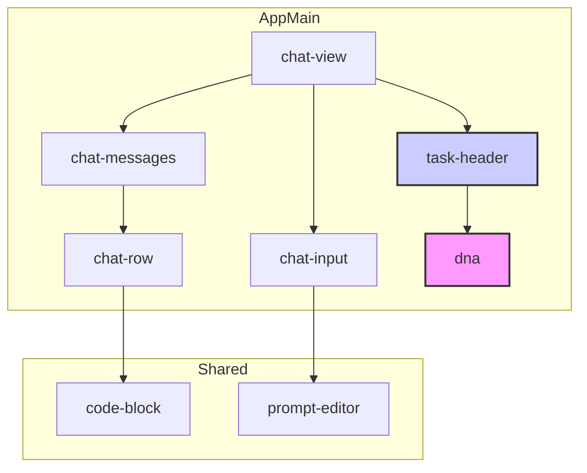

# Components Architecture Document

This document provides a detailed overview of the React components architecture within the `webview-ui-vite/src/components` directory. It serves as a technical guide to understand the role of each component and their interactions.

## 1. High-Level Architecture

The component architecture is designed to be modular and scalable, separating concerns between high-level feature components, core UI elements, and shared utilities.

-   **Feature Components**: High-level components that represent a major feature of the UI (e.g., `chat-view`, `dna`, `history-view`).
-   **Core UI Components (`/ui`)**: A library of generic, reusable UI primitives based on `shadcn/ui` (e.g., `Button`, `Dialog`, `Input`). These are the foundational building blocks.
-   **Shared Components**: Specialized components that are used across multiple features but are not as generic as the `/ui` components (e.g., `code-block`).

### Component Interaction Diagram

This diagram illustrates how the primary feature components collaborate to form the main application screen.

## 2. Feature Components Breakdown

These are the primary drivers of the application's user interface.

### 2.1. `chat-view`
-   **Responsibility**: The central orchestrator for a chat session. It assembles the header, the message list, and the input area into a cohesive view.
-   **Key Files**: `chat-view.tsx`, `chat-screen.tsx`
-   **Interactions**:
    -   Renders `task-header` to display task metadata and controls.
    -   Renders `chat-messages` which, in turn, renders a list of `chat-row` components.
    -   Manages the state of the user's input via `chat-input`.

### 2.2. `dna` (Formerly `book-panel`)
-   **Responsibility**: Implements the **"DNA Context Protocol"**. This component is a sophisticated Mermaid diagram editor that serves as a visual workspace. It allows for the mapping and real-time editing of a task's underlying logic and structure—its "DNA".
-   **Key Files**: `dna.tsx`, `hooks/use-edge-manager.ts`
-   **Interactions**:
    -   Launched and toggled by an action in the `task-header`.
    -   Operates as a slide-out panel, providing a dedicated environment for visual programming and logic mapping without leaving the main chat context.
    -   Its internal architecture is heavily hook-based, with specialized hooks for parsing, editing, and interacting with the Mermaid diagram.

### 2.3. `task-header`
-   **Responsibility**: Displays the title, token count, cost, and primary action buttons for the current task.
-   **Key Files**: `task-header.tsx`
-   **Interactions**:
    -   Provides controls for renaming, downloading, and closing a task.
    -   Contains the trigger button to open the `dna` panel.

### 2.4. `chat-row`
-   **Responsibility**: Renders a single message bubble in the chat history. It is a highly dynamic component capable of displaying various types of content.
-   **Key Files**: `chat-row.tsx`, `markdown-renderer.tsx`
-   **Interactions**:
    -   Conditionally renders different sub-components based on the message type (e.g., user prompt, agent response, tool usage).
    -   Utilizes `code-block` for displaying formatted code snippets with syntax highlighting.
    -   Renders tool-specific outputs and file lists.

### 2.5. `history-view` & `history-preview`
-   **Responsibility**: These components work together to provide a view of past tasks. `history-view` is the main container, while `history-preview` renders individual task cards.
-   **Key Files**: `history-view.tsx`, `history-preview.tsx`

## 3. Core UI Components (`/ui`)

-   **Responsibility**: This directory contains the application's design system. It is a collection of stateless, highly reusable UI components like `Button`, `Card`, `Tooltip`, etc.
-   **Key Principle**: These components are foundational and should never contain business logic. They are imported and used by virtually all other components in the application.

## 4. Shared Components

-   **`code-block`**: A specialized component for rendering code with syntax highlighting, a copy button, and other interactive features. Used primarily by `chat-row`.
-   **`prompt-editor`**: Provides a rich text editing experience for user input, including support for mentions and other special tokens.

## 5. DNA Context Protocol: A New Paradigm

This architecture, particularly the role of the `dna` component, is an early implementation of a new concept: the **DNA Context Protocol**.

This protocol is founded on the principle that a project's core logic can be represented in a highly compressed, structured format, much like biological DNA. It posits that a combination of a **structured diagram** (the traditional logic) and concise **natural language descriptions** (the soul) can encapsulate the essence of a software project within an extremely efficient context window (e.g., under 10,000 tokens for a small project).

### Core Tenets:

-   **High Context Compression Ratio**: By mapping complex codebases to a compact, logical diagram, the protocol achieves a very high compression of information. This allows an advanced AI agent to understand and operate on a project without needing to process the entire source code at once.

-   **Reproducibility**: The protocol aims to create a definitive, descriptive language for software. A project's "DNA" serves as a universal blueprint, enabling the precise reproduction and reconstruction of the software's source code by any sufficiently advanced entity, human or AI.

-   **Software as a Mapped Entity**: Under this protocol, the source code is a direct, physical mapping of the DNA diagram. The diagram is the single source of truth for the software's architecture and logic. This creates a powerful paradigm for AI-driven development, maintenance, and automated refactoring.