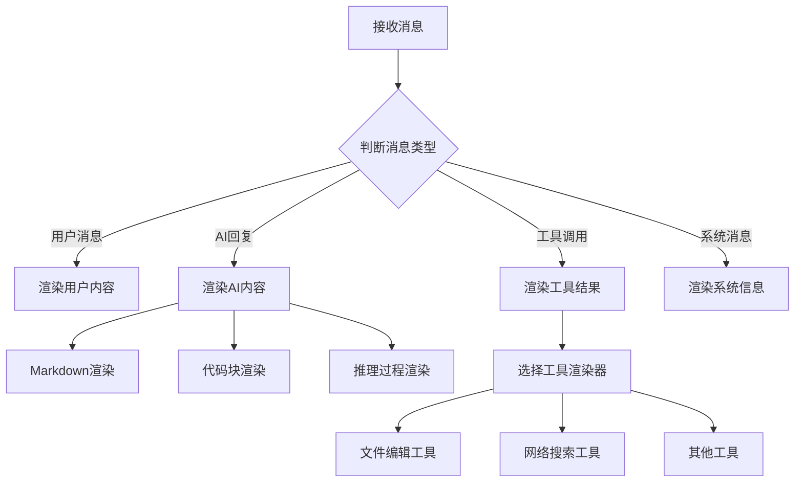

# Chat Row 聊天消息行组件

负责渲染聊天对话中的每一条消息，包括用户消息、AI回复、工具调用、代码块等各种消息类型的显示。

## 📋 组件清单

### 🏠 主要组件
| 组件 | 文件 | 描述 |
|------|------|------|
| ChatRow | `chat-row.tsx` | 消息行主组件，根据消息类型渲染不同内容 |
| ChatRowUtils | `chat-row-utils.tsx` | 消息行工具函数和辅助组件 |

### 🎨 显示组件
| 组件 | 文件 | 描述 |
|------|------|------|
| IconAndTitle | `icon-and-title.tsx` | 消息头部的图标和标题显示 |
| MarkdownRenderer | `markdown-renderer.tsx` | Markdown内容渲染器 |
| CodeBlock | `code-block.tsx` | 代码块显示组件 |
| FileBadge | `file-badge.tsx` | 文件标识徽章 |
| FileList | `file-list.tsx` | 文件列表显示 |

### 🧠 AI功能组件
| 组件 | 文件 | 描述 |
|------|------|------|
| ReasoningRow | `reasoning-row.tsx` | AI推理过程显示 |
| ThinkingSummaryRow | `thinking-summary-row.tsx` | 思考过程摘要显示 |
| DiagnosticRow | `diagnostic-row.tsx` | 诊断信息显示 |

### 🔧 工具调用组件
| 组件 | 文件 | 描述 |
|------|------|------|
| ChatTools | `chat-tools.tsx` | 工具调用渲染器 |

#### 🛠️ 具体工具 (tools/ 目录)
| 组件 | 文件 | 描述 |
|------|------|------|
| AgentTools | `agent-tools.tsx` | 代理工具调用显示 |
| FileEditorTool | `file-editor-tool.tsx` | 文件编辑工具显示 |
| WebSearchTool | `web-search-tool.tsx` | 网络搜索工具显示 |
| HookPreview | `hook-preview.tsx` | Hook预览组件 |
| ObserverHook | `observer-hook.tsx` | 观察者Hook组件 |

## 🏗️ 架构设计

### 消息类型处理
```
ChatRow (主入口)
├── 根据消息类型分发
├── UserMessage (用户消息)
├── AssistantMessage (AI回复)
│   ├── MarkdownRenderer (文本内容)
│   ├── CodeBlock (代码块)
│   ├── ReasoningRow (推理过程)
│   └── ThinkingSummaryRow (思考摘要)
├── ToolCall (工具调用)
│   └── ChatTools (工具渲染器)
│       ├── AgentTools
│       ├── FileEditorTool
│       └── WebSearchTool
└── SystemMessage (系统消息)
```

### 消息渲染流程
```
消息数据 → 类型判断 → 选择渲染器 → 渲染内容 → 显示结果
```

## 🎯 主要功能

### 📝 消息类型支持
- **用户消息** - 用户输入的文本和文件
- **AI回复** - AI生成的回答和分析
- **工具调用** - AI使用工具的过程和结果
- **系统消息** - 系统状态和错误信息
- **推理过程** - AI的思考和推理步骤

### 🎨 内容渲染
- **Markdown支持** - 完整的Markdown语法渲染
- **代码高亮** - 多语言语法高亮
- **文件预览** - 文件信息和缩略图
- **链接处理** - 自动识别和渲染链接

### 🔧 工具集成
- **文件编辑** - 显示文件修改过程
- **网络搜索** - 展示搜索结果
- **代码执行** - 显示代码运行结果
- **数据分析** - 可视化分析过程

### 🧠 AI能力展示
- **思考过程** - 透明化AI的推理步骤
- **决策逻辑** - 展示AI的决策依据
- **错误处理** - 友好的错误信息显示

## 🎨 用户体验

### 视觉设计
- **差异化显示** - 不同角色使用不同样式
- **层次结构** - 清晰的信息层次
- **状态指示** - 加载、成功、错误状态

### 交互功能
- **内容复制** - 一键复制消息内容
- **代码复制** - 独立的代码块复制
- **文件下载** - 直接下载附件文件
- **链接跳转** - 安全的外部链接处理

### 性能优化
- **虚拟滚动** - 大量消息的性能优化
- **懒加载** - 按需加载复杂内容
- **缓存机制** - 避免重复渲染

## 🔧 开发指南

### 添加新的消息类型
1. 在 `chat-row.tsx` 中添加类型判断
2. 创建对应的渲染组件
3. 更新消息类型定义
4. 添加样式和交互逻辑

### 扩展工具支持
1. 在 `tools/` 目录下创建新工具组件
2. 在 `chat-tools.tsx` 中注册工具
3. 实现工具的渲染逻辑
4. 添加工具特定的交互功能

### 自定义渲染器
```tsx
// 示例：添加新的内容类型渲染器
function CustomRenderer({ content }: { content: CustomContent }) {
  return (
    <div className="custom-content">
      {/* 自定义渲染逻辑 */}
    </div>
  )
}

// 在 ChatRow 中使用
if (message.type === 'custom') {
  return <CustomRenderer content={message.content} />
}
```

### 样式定制
- 使用Tailwind CSS类名
- 遵循设计系统颜色规范
- 支持深色/浅色主题
- 保持与整体UI的一致性

## 🔗 相关组件
- [chat-view/](../chat-view/) - 聊天视图主容器
- [code-block/](../code-block/) - 独立的代码块组件
- [ui/](../ui/) - 基础UI组件库

## 📊 消息流程图

