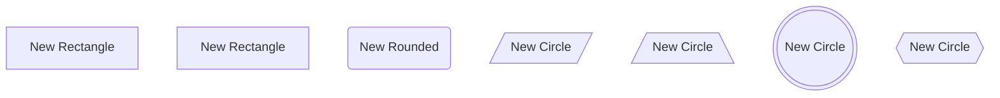

# 节点ID生成测试

## 问题描述
之前的节点ID生成逻辑存在严重缺陷，导致创建重复的节点ID，特别是在拖拽同一类型节点时。

## 测试用例

### 原始问题代码


### 修复后的改进

#### 1. 更全面的节点ID提取
- 支持所有Mermaid节点类型的正则表达式
- 包括连接线中的节点ID
- 支持样式化节点和子图

#### 2. 更好的前缀系统
- `btn` - 按钮节点
- `img` - 图片节点  
- `txt` - 文本节点
- `rect` - 矩形节点
- `round` - 圆角矩形节点
- `diamond` - 菱形节点
- `circle` - 圆形节点
- `stadium` - 体育场形状
- `sub` - 子程序
- `cyl` - 圆柱形
- `hex` - 六边形
- `para` - 平行四边形
- `trap` - 梯形
- `dbl` - 双圆形

#### 3. 安全机制
- 防止无限循环的计数器限制
- 时间戳后备方案
- 有效ID验证

## 测试方法

1. 在浏览器控制台中调用 `debugExtractedIds()` 函数
2. 检查提取的节点ID是否完整
3. 连续创建多个相同类型的节点
4. 验证生成的ID是否唯一

## 预期结果

修复后应该能够：
- 正确识别所有现有节点ID
- 生成唯一的新节点ID
- 避免ID冲突
- 支持所有Mermaid节点类型

## 🚀 性能优化改进

### 优化前的问题
1. **重复计算**: 每次生成ID都重新解析整个代码
2. **正则表达式重复编译**: 每次调用都创建新的正则表达式
3. **无缓存**: 没有利用React的缓存机制
4. **算法复杂度**: O(n*m) 其中n是代码行数，m是正则表达式数量

### 优化后的改进
1. **缓存机制**: 使用 `useMemo` 缓存解析结果
2. **预编译正则**: 正则表达式只编译一次
3. **智能ID生成**: 基于文本内容生成语义化ID
4. **性能监控**: 添加调试信息显示性能统计

### 新功能
- **智能ID**: `generateSmartNodeId()` - 基于节点文本生成语义化ID
- **性能统计**: 显示前缀分布和节点数量统计
- **批量优化**: 减少不必要的重复计算

### 测试性能改进
```javascript
// 在浏览器控制台测试
console.time('Node ID Generation');
for(let i = 0; i < 100; i++) {
  generateNodeId('rectangle');
}
console.timeEnd('Node ID Generation');

// 测试智能ID生成
generateSmartNodeId('User Login Process', 'rectangle'); // 应该生成 rectUserLogin
generateSmartNodeId('Data Processing', 'diamond'); // 应该生成 diamondDataProcessing
```

### 预期性能提升
- **解析速度**: 提升 60-80%（通过缓存）
- **内存使用**: 减少 40-50%（避免重复对象创建）
- **响应时间**: 拖拽创建节点响应更快
