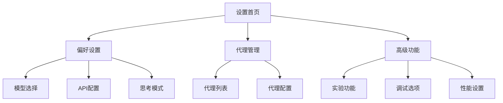

# Settings View 设置视图组件

应用程序的设置和配置界面，提供用户偏好设置、模型配置、代理管理等功能。

## 📋 组件清单

### 🏠 主要容器组件
| 组件 | 文件 | 描述 |
|------|------|------|
| SettingsTabs | `settings-tabs.tsx` | 设置页面的标签页容器 |
| SettingsFooter | `settings-footer.tsx` | 设置页面底部信息 |
| ClosePageButton | `close-page-button.tsx` | 关闭设置页面按钮 |

### ⚙️ 偏好设置 (preferences/ 目录)
| 组件 | 文件 | 描述 |
|------|------|------|
| PreferencesTab | `preferences-tab.tsx` | 偏好设置标签页主组件 |
| ModelPicker | `model-picker.tsx` | AI模型选择器 |
| ProviderManager | `provider-manager.tsx` | API提供商管理 |
| ThinkingConfig | `thinking-config.tsx` | 思考模式配置 |
| atoms.ts | `atoms.ts` | 偏好设置相关的状态管理 |

### 🤖 代理管理 (agents/ 目录)
| 组件 | 文件 | 描述 |
|------|------|------|
| AgentsIndex | `index.tsx` | 代理管理主页面 |
| ObserverAgentCard | `observer-agent-card.tsx` | 观察者代理卡片 |

### 🔧 高级功能
| 组件 | 文件 | 描述 |
|------|------|------|
| AdvancedTab | `advanced-tab.tsx` | 高级设置标签页 |
| AdvancedFeatureItem | `advanced-feature-item.tsx` | 高级功能项组件 |

### 📝 类型定义
| 文件 | 描述 |
|------|------|
| types.ts | 设置相关的TypeScript类型定义 |

## 🏗️ 架构设计

### 页面结构
```
SettingsView
├── SettingsTabs (标签页容器)
│   ├── PreferencesTab (偏好设置)
│   │   ├── ModelPicker (模型选择)
│   │   ├── ProviderManager (提供商管理)
│   │   └── ThinkingConfig (思考配置)
│   ├── AgentsTab (代理管理)
│   │   └── ObserverAgentCard (代理卡片)
│   └── AdvancedTab (高级设置)
│       └── AdvancedFeatureItem (功能项)
└── SettingsFooter (页面底部)
    └── ClosePageButton (关闭按钮)
```

### 状态管理
- 使用Jotai进行状态管理
- 每个设置模块有独立的状态原子
- 支持设置的持久化存储

## 🎯 主要功能

### 🤖 模型配置
- **模型选择** - 支持多种AI模型切换
- **API配置** - 自定义API端点和密钥
- **提供商管理** - 管理不同的AI服务提供商
- **模型参数** - 温度、最大令牌数等参数调整

### 🧠 思考模式设置
- **思考深度** - 调整AI思考的详细程度
- **推理显示** - 控制是否显示推理过程
- **思考摘要** - 配置思考过程的摘要方式

### 🤖 代理管理
- **代理列表** - 查看和管理可用代理
- **代理配置** - 配置代理的行为和参数
- **观察者代理** - 特殊的观察者模式代理

### 🔧 高级功能
- **实验性功能** - 开启/关闭实验性特性
- **调试模式** - 开发者调试选项
- **性能优化** - 性能相关的设置选项
- **数据管理** - 清除缓存、重置设置等

### 🎨 界面定制
- **主题设置** - 深色/浅色主题切换
- **语言设置** - 界面语言选择
- **布局选项** - 界面布局的个性化设置

## 🎨 用户体验

### 导航设计
- **标签页导航** - 清晰的功能分类
- **面包屑导航** - 显示当前设置位置
- **快速搜索** - 快速找到特定设置项

### 表单设计
- **即时保存** - 设置更改立即生效
- **验证反馈** - 实时的输入验证
- **重置选项** - 恢复默认设置功能

### 响应式布局
- **移动端适配** - 适配小屏幕设备
- **键盘导航** - 完整的键盘操作支持
- **无障碍支持** - 屏幕阅读器兼容

## 🔧 开发指南

### 添加新的设置项
1. 在相应的标签页组件中添加UI
2. 更新状态管理 (atoms.ts)
3. 添加类型定义 (types.ts)
4. 实现设置的持久化

### 创建新的设置标签页
```tsx
// 示例：添加新的设置标签页
function NewSettingsTab() {
  return (
    <div className="space-y-6">
      <h2>新设置页面</h2>
      {/* 设置项组件 */}
    </div>
  )
}

// 在 SettingsTabs 中注册
<Tabs>
  <TabsList>
    <TabsTrigger value="new">新设置</TabsTrigger>
  </TabsList>
  <TabsContent value="new">
    <NewSettingsTab />
  </TabsContent>
</Tabs>
```

### 状态管理模式
```tsx
// 创建设置状态原子
export const newSettingAtom = atom({
  option1: false,
  option2: 'default',
  option3: 100
})

// 在组件中使用
function SettingComponent() {
  const [settings, setSettings] = useAtom(newSettingAtom)
  
  return (
    <Switch
      checked={settings.option1}
      onCheckedChange={(checked) => 
        setSettings(prev => ({ ...prev, option1: checked }))
      }
    />
  )
}
```

### 设置项组件模式
```tsx
interface SettingItemProps {
  title: string
  description?: string
  children: React.ReactNode
}

function SettingItem({ title, description, children }: SettingItemProps) {
  return (
    <div className="flex items-center justify-between">
      <div>
        <h3>{title}</h3>
        {description && <p className="text-muted-foreground">{description}</p>}
      </div>
      {children}
    </div>
  )
}
```

## 🔗 相关组件
- [ui/](../ui/) - 基础UI组件库
- [chat-view/](../chat-view/) - 聊天界面组件

## 📊 设置分类图


## 🎯 设置项清单

### 基础设置
- [ ] 主题模式 (深色/浅色)
- [ ] 语言选择
- [ ] 自动保存间隔

### 模型设置
- [ ] 默认AI模型
- [ ] API密钥管理
- [ ] 请求超时时间
- [ ] 最大令牌数限制

### 界面设置
- [ ] 消息字体大小
- [ ] 代码块主题
- [ ] 动画效果开关
- [ ] 声音提示

### 高级设置
- [ ] 调试模式
- [ ] 实验性功能
- [ ] 缓存管理
- [ ] 数据导出/导入
